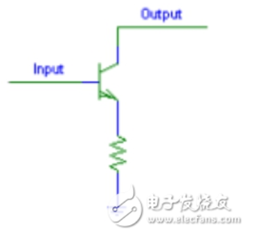
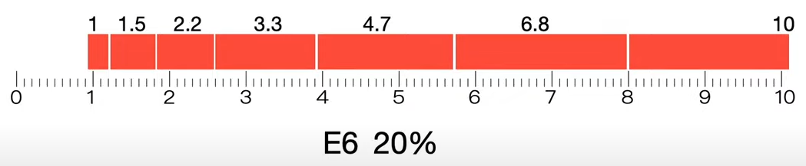

```Text
Author: Antony_Weng <weng851107@gmail.com>

This file is only used for the record of the learning process, only used by myself and the file has never been leaked out.
If there is related infringement or violation of related regulations, please contact me and the related files will be deleted immediately. Thank you!
```

# 目錄

- [Introduction](#0)
  - [電路介紹](#0.1)
    - [上拉(Pull Up)電阻](#0.1.1)
    - [下拉(Pull Down)電阻](#0.1.2)
    - [集電極開路(Open Collector, OC)](#0.1.3)
    - [漏極開路（Open Drain, OD）](#0.1.4)
    - [門電路](#0.1.5)
    - [Open-drain（開漏）和push-pull（推挽）](#0.1.6)
  - [邏輯分析儀 (Logic Analyzer)](#0.2)
    - [邏輯分析儀的9件事](#0.2.1)
  - [電容](#0.3)
    - [電容的作用](#0.3.1)
  - [SD-card](#0.4)
    - [基本知識介紹](#0.4.1)
  - [交流與直流信號](#0.5)
  - [50個電路符號](#0.6)
  - [十一分鐘略懂電子電路：電、電路、電阻、電容、電感、二極體、三極體、MOSFET 簡介及相關應用](#0.7)
  - [結型場效應管(Junction Field-Effect Transistor, JFET)的工作原理](#0.8)
  - [工業標準電阻, 電容與電感大小值的規範](#0.9)
  - [帶寬(bandwidth)與寬帶](#0.10)
- [嵌入式開發板硬件操作入門](#1)
  - [01_預備知識與概述](#1.1)
    - [1-1_物理知識回顧](#1.1.1)
    - [1-2_電路圖概念](#1.1.2)
    - [1-3_硬件接口的四大類](#1.1.3)
  - [02_GPIO類電路](#1.2)
    - [2-1_GPIO與門電路](#1.2.1)
    - [2-2_LED電路與操作](#1.2.2)
    - [2-3_七段數碼管](#1.2.3)
    - [2-4_蜂鳴器電路與操作](#1.2.4)
    - [2-5_電機驅動板](#1.2.5)
    - [2-6_紅外避障傳感器模塊](#1.2.6)
  - [03_一線協議類電路(傳感器、遙控器)](#1.3)
    - [3-1_同步與異步](#1.3.1)
    - [3-2_使用一線傳輸雙向數據](#1.3.2)
    - [3-3_DHT11溫濕度傳感器](#1.3.3)
    - [3-4_DS18B20溫度傳感器](#1.3.4)
    - [3-5_紅外線遙控協議簡介及編程思路](#1.3.5)
    - [3-6_硬件知識_UART硬件介紹](#1.3.6)
- [嵌入式攻城獅必備知識](#2)
  - [01_GPIO與門電路之原理圖](#2.1)
  - [02_協議類之原理圖](#2.2)
    - [2-1_協議接口UART之原理圖](#2.2.1)
    - [2-2_協議接口I2C之原理圖](#2.2.2)
    - [2-3_協議接口SPI之原理圖](#2.2.3)
    - [2-4_協議接口NAND FLASH之原理圖](#2.2.4)
    - [2-5_協議接口LCD之原理圖](#2.2.5)
  - [03_類似內存(ram-like)的接口之原理圖](#2.3)
    - [3-1_SDRAM、NOR FLASH、網卡](#2.3.1)
    - [3-2_不同位寬外設的接線與訪問過程](#2.3.2)
    - [3-3_怎麼確定訪問地址與設置內存控制器](#2.3.3)
  - [04_介紹幾個開發版之原理圖](#2.4)
    - [4-1_S3C2410](#2.4.1)
    - [4-2_S3C2440](#2.4.2)
    - [4-3_S3C6410](#2.4.3)

<h1 id="0">Introduction</h1>

<h2 id="0.1">電路介紹</h2>

- `懸空`：設想你有一個MCU，它有一個配置成輸入的引腳。如果沒有東西連線在該引腳上，並且你的程式要讀這個引腳的狀態，這個狀態是高（拉到VCC）還是低（接地）？這很難說。這種情況叫做懸空。

- 干擾的發生是因為引腳懸空 + 電磁干擾，形成不穩定的訊號輸入

- 下拉電阻與上拉電阻主要的功能用於抗干擾與預設默認電平

   

<h2 id="0.1.1">上拉(Pull Up)電阻</h2>

- 電阻在電路中起限制電流的作用

- 對於某些集成電路或電晶體電流和電壓的能力是有限的，上拉電阻的功能主要是為集電極開路輸出型電路`增強其電流通道`。如果不用，會降低電路的執行能力，例如驅動能力不足或欠驅動狀態，導致工作失常，不能準確完成設計者意圖。

**1. 概念：**

- 將一個不確定的信號，通過一個電阻與電源VCC(通常3.3V或者5V)相連，固定在高電平。

- 小電阻值叫做強上拉（更多電流），高電阻值叫做弱上拉（小電流）

- 經常和按鍵以及開關在一起使用

   

**2. 原理：**

- `按鍵按下，引腳電平拉低`。R1的阻值控制你希望VCC流出多少電流通過按鍵到地。

- `按鍵未按下，引腳電平拉高`。上拉電阻控制引腳的電平。

- 上拉電阻可以使引腳即使在未連接外部組件的時候也能保持確定的邏輯電平。

- 上拉電阻阻值越大，引腳響應電壓變化也就越慢。這是因為系統提供的引腳實際上是一個電容和一個上拉電阻的組合，因此組成一個`RC濾波器`，並且RC濾波器需要時間充電和放電。

**3. 計算Pull-Up Resistor**


<h2 id="0.1.2">下拉(Pull Down)電阻</h2>

- 電阻在電路中起限制電流的作用

- 下拉電阻是為了幫助電晶體或集成電路分流亦或是確保電路準確達到設計`低電平位`，防止誤觸發或灌電流損壞電路。

**1. 概念：**

- 將一個不確定的信號，通過一個電阻與GND相連，固定在低電平。

   

**2. 主要作用：**

- 下拉電阻的主要作用是與上接電阻一起在電路驅動器關閉時給線路(節點)以一個固定的電平。

<h2 id="0.1.3">集電極開路(Open Collector, OC)</h2>

- 集電極開路電路中的“集”就是指三極管的集電極

- 在數字電路中，簡稱OC門。

- 集電極開路電路是灌電流輸出器件。
  - 在關斷狀態時，集電極開路輸出連到地
  - 在導通狀態時，集電極開路輸出懸空

   

- 因此，集電極開路輸出需要一個源電流輸入接口。典型的集電極開路電路如下圖所示。電路中右側的三極管集電極什麽都不接，所以叫做集電極開路，左側的三極管用於反相作用，即左側輸入“0”時左側三極管截止，VCC通過電阻加到右側三極管基極，右側三極管導通，右側輸出端連接到地，輸出“0”。

   

- 從圖中電路可以看出集電極開路是無法輸出高電平的，如果要想輸出高電平可以在輸出端加上上拉電阻。因此集電極開路輸出可以用做電平轉換，通過上拉電阻上拉至不同的電壓，來實現不同的電平轉換。

<h2 id="0.1.4">漏極開路（Open Drain, OD）</h2>

- 開漏電路就是指從MOSFET的漏極輸出的電路。

- 典型的用法是在漏極外部的電路添加上拉電阻到電源如圖所示。完整的開漏電路應由開漏器件和開漏上拉電阻組成。這裏的上拉電阻R的阻值決定了邏輯電平轉換的上升/下降沿的速度。阻值越大，速度越低，功耗越小。

- 標準的開漏腳一般只有輸出的能力。添加其它的判斷電路，才能具備雙向輸入、輸出的能力。

   

**特點：**

- 利用外部電路的驅動能力，減少ic內部的驅動

- 可以將多個開漏輸出的pin，連接到一條線上。通過一只上拉電阻，在不增加任何器件的情況下，形成“與邏輯”關系。

- 可以利用改變上拉電源的電壓，改變傳輸電平

- 開漏pin不連接外部的上拉電阻，則只能輸出低電平。一般來說，開漏是用來連接不同電平的器件，匹配電平用的

<h2 id="0.1.5">門電路</h2>

- 用以實現基本邏輯運算和複合邏輯運算的單元電路稱為門電路。

- 常用的門電路在邏輯功能上有與門、或門、非門、與非門、或非門、與或非門、異或門等幾種。

<h2 id="0.1.6">Open-drain（開漏）和push-pull（推挽）</h2>

Open-drain（開漏）和push-pull（推挽）是兩種不同的輸出驅動方式

1. Open-drain（開漏）輸出：

   - 開漏輸出結構通常用在MOSFET（金屬氧化物半導體場效應管）輸出電路中。一個典型的開漏輸出電路包含一個N溝道MOSFET，其源極接地，漏極接到外部信號線。在此結構下，輸出只能通過MOSFET的開閉來控制信號線電平。
   - 當MOSFET導通（開啟）時，輸出信號線被連接到地（低電平）。而當MOSFET截止（關閉）時，輸出信號線處於高阻態，沒有任何連接。為了讓信號線達到高電平狀態，需要在信號線上添加一個上拉電阻（pull-up resistor）來將線路連接至一個正電壓源。當MOSFET關閉時，上拉電阻將信號線拉至高電平。

2. Push-pull（推挽）輸出：

   - 推挽輸出結構是一種雙極性輸出結構，通常由兩個MOSFET（一個N溝道和一個P溝道）組成。在推挽電路中，這兩個MOSFET交替導通和截止，從而實現輸出信號線的高低電平控制。

   - 當N溝道MOSFET導通，P溝道MOSFET截止時，輸出信號線被拉低至地（低電平）。當P溝道MOSFET導通，N溝道MOSFET截止時，輸出信號線被拉高至正電壓（高電平）。通過交替控制這兩個MOSFET的導通和截止，推挽電路實現對輸出信號線電平的有效控制。

   - 推挽輸出相較於開漏輸出具有較高的驅動能力和響應速度，因為它同時具備上拉和下拉驅動能力。在實際應用中，推挽輸出通常用於高速數字信號傳輸和驅動較大負載。

- 總之，開漏輸出和推挽輸出的原理主要在於不同的輸出電路結構。開漏輸出由單個N溝道MOSFET控制信號線的低電平，而高電平由外部上拉電阻實現。推挽輸出則使用一對N溝道和P溝道MOSFET交替控制信號線的高低電平。根據實際應用需求，可以選擇合適的輸出方式。

使用情景：

1. Open-drain（開漏）：

   - 總線通信：開漏配置常用於I2C、1-Wire等總線通信協議，因為它允許多個設備共享同一根信號線，而不會導致衝突。當設備的輸出為低電平時，信號線被拉低，而當設備不驅動信號線時，線路處於高阻態。
   - 電平轉換：開漏輸出還可用於電平轉換，特別是當連接的設備使用不同的電源電壓時。通過將開漏輸出與上拉電阻相結合，可以將輸出信號轉換為其他電壓水平。
   - 簡單的線路保護：開漏輸出可提供一定程度的線路保護，例如在一個錯誤連接的情況下，不會短路輸出設備。

2. Push-pull（推挽）：

   - 數字信號傳輸：推挽輸出常用於數字信號傳輸，如GPIO（通用輸入/輸出）引腳。推挽輸出能夠更快速地驅動信號線電平的上升和下降，因此適用於需要快速響應的場合。
   - 較高負載驅動能力：相較於開漏配置，推挽輸出具有較高的驅動能力，可以驅動較大的負載電流。
   - 電源分佈：推挽輸出可用於為其他電路提供電源。例如，在集成電路上，某些引腳可以配置為推挽輸出，為其他器件提供穩定的供電。

- 總結：開漏輸出適用於總線通信、電平轉換和提供一定程度的線路保護，而推挽輸出適用於快速響應的數字信號傳輸、驅動較大負載電流和電源分佈。在實際應用中，需要根據具體的設計需求和場景選擇合適的輸出方式。

<h2 id="0.2">邏輯分析儀 (Logic Analyzer)</h2>


[Tektronix_邏輯分析儀概念與基本原理.pdf](./doc/Tektronix_邏輯分析儀概念與基本原理.pdf)

[Tektronix_LA入門手冊.pdf](./doc/Tektronix_LA%E5%85%A5%E9%96%80%E6%89%8B%E5%86%8A.pdf)

<h3 id="0.2.1">邏輯分析儀的9件事</h3>

**1. 資料擷取模式：** 狀態模式(state mode)與時間模式(timing mode)

- 時間模式(又稱非同步模式)是示波器與邏輯分析儀共用的取樣方式，系統可依內部取樣時脈，以固定時間間隔對訊號進行取樣。

- 利用時間模式您可檢視狀態機，但所顯示的狀態中會夾雜所有的暫態。

   

- 不同邏輯分析儀的狀態模式(又稱同步模式)都各不相同。利用此模式，您可從裝置端觀點來查看訊號。如此一來，您無需設定內部時脈的取樣間隔，而是將裝置的時脈連接至邏輯分析儀，以作為取樣時脈。

- 狀態模式的主要優點在於，您可藉由檢視狀態機的動作是否與裝置一致，來確認狀態機的運作狀況。例如：若裝置的接收器因轉變太快而略過某個狀態，在狀態模式中可輕易看出。

- 狀態模式的另一優點是無須對訊號過度取樣，以取得其特性，而且每個時脈週期只需取樣一次。

   

**2. 記憶體深度：** 很深的記憶體深度

**3. 通道數：** 擁有可處理大量通道的能力，您便能同時從多個匯流排中擷取具時間關聯性的訊號

- 邏輯分析儀是理想的DDR記憶體除錯工具，例如：DDR裝置出現問題時，只要將DDR裝置連接在邏輯分析儀上，便可找出是哪個通道所造成的。隨後使用示波器進一步分析該通道的問題。

- 邏輯分析儀擷取到的系統級數位資訊

- 示波器擷取到獨立通道的類比資訊能力

**4. 先進的觸發排序器：** 邏輯分析儀允許使用者指定8種以上發生於邏輯分析儀觸發之前的條件，並儲存所擷取的資料

- 多數示波器的觸發功能都是對類比通道進行觸發，如此將嚴重限制示波器對特定事件進行觸發的能力。

- 排序器功能強大，因為它們允許使用者結合運用各種不同的條件，以便對特定或偶發事件進行觸發。

**5. 協定相符性與效能分析工具：** 邏輯分析儀通常具有複雜的協定相符性和多種分析功能，讓您能可供測試裝置對特定協定規格測試裝置的相符性

- DDR效能分析工具可有效檢驗您的DDR系統是否完全利用到可用的記憶體空間，還可察覺後續可能遭遇的問題

**6. 時序縮放：** 多數邏輯分析儀可放大觸發點附近的取樣頻寬， 此一高速模式可提供比分析儀正常頻寬更大的頻寬，但其記憶深度極為有限

**7. 檢視示波器資料：** 將示波器連接到邏輯分析儀，以擷取並檢視邏輯分析儀的時間關聯性資料

**8. FPGA分析：** 只能檢視內部FPGA訊號。使用邏輯分析儀，則可探量電路板的訊號，進而找出整體系統階層中，FPGA 實際產生的問題，甚至還能檢視具時間關聯性的訊號。

**9. 內建的碼型產生器：** 碼型產生器(pattern generator)是可產生數位訊號的工具。您可設計測試訊號並傳送到裝置，然後利用邏輯分析儀觀察裝置的激發響應。

<h2 id="0.3">電容</h2>

<h3 id="0.3.1">電容的作用</h3>


**1. 降壓**

- 透過串聯電容，將作用於元件的電壓符合其工作電壓

    

    

- 電容的阻抗只與頻率和電容量有關

    

- 透過分壓定理，推得電容的阻抗應該要是多少，進而求得要使用多少電容量的電容

    

    

- 當電壓源斷電時，電容還是會保持高電壓，為了防止人體觸電，通常會並聯一個阻抗極高的電阻，讓電容的店透過阻抗釋放

    

- 當今天如果電流量小的話，可以直接利用電阻取代電容作分壓。但由於電阻是消耗有功功率的元件，存在發熱問題，而電容是無消耗的無功功率，故大電流時會使用電容作分壓

**2. 濾波**

- 濾波本質上是利用電容來作降壓功能，以高通濾波器為例

    

- 直流電的頻率為0，因此電容的阻抗會是無限大

    

- 因此10V幾乎都在電容上，輸出會是接近0V，所以低頻訊號是沒辦法通過高通濾波器的

    

- 若今天施加頻率極大的交流電，會使得電容的阻值趨近於0，進而電容所分配到的電壓會是0V，所以輸出會是10V，高頻信號可以通過

    

    

- 隨著頻率升高，電容的阻值會越低，進而導致輸出的電壓越高

**3. 延時**

- 電容充電有充電曲線，從電壓的10%到90%，需要花2.2倍RC值得時間

    

- 當今天在操作控制晶片時，若希望訊號有延時的效果時，可以透過挑選合適的RC值來完成這件事情

    

**4. 耦合**

- 在兩個元件中間，透過電容把直流訊號(低頻訊號)剃除，只把交流訊號傳遞給後面的元件電路。能通過耦合電容的是有用的信號

    

**5. 旁路**

- 旁路電容與耦合電容非常相似，耦合電容是剃除低頻訊號，而旁路電容是剃除交流訊號(高頻訊號)

    

- 通常在給IC，Vcc時，會並聯一顆電容，對於高頻的干擾訊號，會通過電容流向地，作為剃除高頻訊號的作用，從而使晶片免除高頻訊號的干擾

    

- 通常旁路電容都會緊靠晶片，若距離太遠的話，這段導線可能會受到噪音與電磁干擾的影像，進而繼續產生高頻訊號來干擾晶片

    

<h2 id="0.4">SD-card</h2>

<h3 id="0.4.1">基本知識介紹</h3>

1. SD協會(全名SD Association)是制定記憶卡標準的組織，目前按照外型尺寸，分為SD、miniSD、microSD三種。
   - microSD卡運用範圍較廣泛，如智慧型手機、數位單眼、行車紀錄器、GoPro/運動攝影機等
   - miniSD卡除了很舊的設備如PDA、掌上型電腦以外，已經很少廠商在製造
   - SD卡多為數位相機或攝影機使用

    

2. 記憶卡容量分為四個不同標準SD、SDHC（SD High Capacity）、SDXC（SD Extended Capacity）、SDUC（SD Ultra Capacity）。FAT檔案系統：FAT16、FAT32、exFAT，Windows和Mac 的作業系統皆可以支援FAT檔案，但因為FAT32預設單檔容量最大只能到4GB，為了因應高畫質影音的大檔案時代來臨，才有了進化版的exFAT，可以在Windows 7、Mac OS X 10.6.5及以上版本作業系統使用。

  

  

3. SDIO3.0才能夠分辨SD-card的High Speed與Ultra Speed

<h2 id="0.5">交流與直流信號</h2>

交流電直流電的差別是，直流電只有一個方向，交流電不止一個方向

交流信號和直流信號對應交流電和直流電

基本的信號要分三種：

- 交流信號
- 直流信號
- 交直流混合信號/交直流疊加信號

直流信號

- 只有一個方向的電流過來

交流信號

- 大小變化，方向也變化的信號
- 大小變化任意一個方向都能夠變化到0，也就是這段電，無論從多高變化，都能夠最終變到沒有，然後換方向
- 換方向之前，如果沒有變化到0，也就是還存在另一個方向的電流，那麼這個信號是交直流疊加信號

電容是隔斷不變的電信號，通過變化的電信號，可簡稱隔直通交
電感是阻礙變化的電信號，通過不變的電信號，可簡稱隔交通直

<h2 id="0.6">50個電路符號</h2>


<h2 id="0.7">十一分鐘略懂電子電路：電、電路、電阻、電容、電感、二極體、三極體、MOSFET 簡介及相關應用</h2>

https://www.youtube.com/watch?v=V3A0fxmhYrg

電子存在於所有元素中，當電子離開原子形成自由流動的電時，就會形成電流

元素週期表中的銅(Cu)銀(Ag)金(Au)，最外層有一個電子，容易受到外力而離開原子形成電流，其中地球上又以同元素最容易取得，因此基本上都會以銅作為導線材料

要讓電子離開原子需要施加壓力，所謂壓力即是電壓

- 電會從高電壓流向低電壓形成電流
- 單位為伏特(V)，物理意義是移動每庫倫的電荷所需消耗的焦耳能量

    

帶負電的電子流流向某個方向，即等效正電荷流流往相反的方向，形成電流(I)，以每秒鐘通過的電荷數量來量化電流大小，單位為安培(A)，1安培指的是每秒通過1庫倫的電荷


有電壓與電流就可以計算出每秒消耗的功率是多少，單位是瓦特(W)，不同的電壓與電流組合會形成不同的功率，因此單看電壓或電流是無法得知功率大小的，所以電氣才會標有電壓與電流的標示


---

電路是由封閉的導體組合的封閉迴路，提供電流往返通行所需要的路徑


當電路形成短路時，大量電流會以超高功率把能量釋放為熱能，進而燒壞電路

電阻: 阻礙電流通過的能力，根據歐姆定律，在1伏特電壓下，能控制電流在1安培的電阻值為1歐姆

電容: 能在電壓帶動下儲存正負電荷，進而緩衝電壓變化的一種電子元件。當在電容的兩端施加電壓，兩片導體薄板會逐漸累積正負電荷，直到薄板兩端電壓與外部施加的電壓相互抵消為止。一旦外部電壓消失，電榮本身的電壓就能將儲存的正負電荷逐步釋放出來


- 對於直流電來說，電容就是一個儲能元件，作為"緩衝平滑電壓變化的效果"，在外部電壓不穩定的情況下，能讓後續元件保有相對穩定的電壓

- 對於交流電來說，來回擺動的電流則會輪流電容兩極充放電，等同通路一樣

- 電容大小由 $C=Q/V$ 得出，單位為法拉(F)，在每1伏特電壓下，能儲存1庫倫電量的電容量為1法拉

電感:主要由線圈組成，利用電磁感應儲存與釋放磁能，產生臨時的電壓以抵抗電流的改變，因此有"平滑電流變化的效果"

- 兩個不同繞組匝數的電感相互連動影響，則可以輕易達到交流電變壓的效果


電阻、電容與電感通常作為電器中被動配合輔助其它元件的角色，因此被稱作"被動元件"

"主動元件"能主動控制電流的流向與開關，通常作為電器當中核心邏輯運算的角色

導體只需微小的能量即能讓電子離開原子，反之絕緣體透過極大的能量也難以讓電子離開原子，因此半導體就很適合作為精準控制電流的開關

矽元素在地球上唾手可得，因此成為半導體主要的材料

- 在半導體中摻入5價元素，會讓整體較容易丟失電子，而稱為N型半導體
- 在半導體中摻入3價元素，會讓整體較容易吸收電子，而稱為P型半導體

    

藉由N型與P型半導體的搭配就可得作到電流控制

二極體：一種只允許電流單方向通過的電子元件

- 順向電壓使電子與電洞都會被推向另一極而形成電流通路
- 逆向電壓使電子與電洞會被吸附在各自那極而無法流動

    

由二極體延伸，三極體採用NPN或PNP的排列，並透過NP型半導體個別濃度的差異來產生電流放大的效果，透過"電流"來控制訊號

- 在基極B(base)的小電流帶動下，射極E(emitter)與集極C(collector)之間會有大電流通過
- 可用於放大類比電路的訊號
- 以小電流控制大電流的通過與否作為數位電路的開關
- AntonyNote: 
  - NPN: E(-), 電流由B極流入, C->E
  - PNP: E(+), 電流由B極流出, E->C 

    

MOSFET則是以"電壓"來控制訊號

增強型MOS在閘極G(gate)施加電壓的帶動下，使源極S(source)與汲極D(drain)之間的通道形成通路


- AntonyNote:
  - E-NMOS: S(-), $V_{GS}>+V_{th}$ -> $I_{DS}$
  - E-PMOS: S(+), $V_{SG}>+V_{th}$ -> $I_{SD}$

空乏型NOS的源極S(source)與汲極D(drain)之間原本就是通路，在閘極G(gate)施加電壓的帶動下，將關閉通路

- AntonyNote:
  - D-NMOS: S(-), $V_{SG}>+V_{th}$ -> $I_{DS}=0$
  - D-PMOS: S(+), $V_{GS}>+V_{th}$ -> $I_{SD}=0$

根據主動元件即可組合出各種邏輯閘，再由邏輯閘之間的相互搭配進行各種複雜的運算

---

電源作為驅動電器的心臟
被動元件穩定整個電路的電壓與電流
主動元件作為電器的控制電流通過的開關
最後加上輸入與輸出元件(I/O)即可組合出各種應用


發電原理

- 電磁感應: 透過風力火力水力等動能方式帶動磁鐵轉動，以磁場變化帶動電場變化進而產生電流

    

- 太陽能發電： 太陽能打在PN半導體上，使電子與電洞往兩端移動進而產生電流

    

交流電轉直流電：

- 先透過二極體進行整流
- 再以電容緩衝電壓的特性平滑整流後的波形
- 進而可以產生接近穩定的直流電源

    

<h2 id="0.8">結型場效應管(Junction Field-Effect Transistor, JFET)的工作原理</h2>


JFET控制方式(N溝道)

- 在柵極(G)施加0V，會使漏極(D)與源極(S)相通
- 在柵極(G)施加反向電壓(-5V)，會使漏極(D)與源極(S)截止


JFET工作原理

- N型半導體的兩端分別為漏極(D)與源極(S)，P型半導體在N型的兩邊，且兩個P型半導體是相通的，作為柵極(G)
- 在柵極(G)施加0V時，N型半導體中的自由電子會因為外部電壓而流動，故此時是導通的

    

    

- 當隊柵極(G)施加足夠的反向偏壓時，使得空乏層(depletion region)加寬，導致自由電子無法通過，而形成截止

    

Note: 空乏層(depletion region)是指PN接面中在漂移運動和擴散作用的雙重影響下載子數量非常少的一個高電阻區域

- N型半導體的自由電子相較於P型半導體多很多，所以N型半導體的自由電子會往P型半導體擴散

    

- N型半導體的磷原子失去一個電子後就會成為正離子，所以N型半導體會形成一個正離子區，反之P型半導體會形成一個負離子區

    

- 兩個離子區又被稱為空乏層(depletion region)，是高電阻區域，若施加反向電壓會使其加寬，絕緣的效果會更提升

    

<h2 id="0.9">工業標準電阻, 電容與電感大小值的規範</h2>

因為不可能把每一個數值的元件都製造出來，所以根據分度與精度(誤差，分度越細精度越高)分為 `E(Electricity)6`, `E12`, `E24`, `E48` ......等等

以E6來說, 即在 $1 <= X < 10$ 之間取 6 的數值作為設計規範值，即以 $\sqrt[6]{10} = 1.5$ 作為公比來規範數值，因此每個數值與前一個數值都具有相同的倍數，且加上每種規範的製作誤差值，透過這幾個規範值即可以接近將1~10之間的數值包含起來





精度越高的規範，其規範值會包含其精度比它低的所以數值


<h2 id="0.10">帶寬(bandwidth)與寬帶</h2>

帶寬(bandwidth)，頻帶(Band)寬度(Width)

- 其應用領域非常廣泛，以下圖幾個作為介紹

    

電磁波：

- 最新應用帶寬的領域，指的是最高頻率與最低頻率之間的差值

    

- 以可見光為例，紅與橙之間的帶寬為(482-385)Thz

    

    

模擬信號：：

- 濾波器
  - 高通濾波器：高於截止頻率$f_1$的信號才可通過

    

  - 低通濾波器：低於截止頻率$f_2$的信號才可通過

    

  - 帶通濾波器：將高低通濾波器結合在一起，只有介於$f_1$與$f_2$之間的信號才可通過，其帶寬即為$f_1-f_2$

    

數字信號：

- 帶寬表示為每秒可以傳輸的bits數，即 `bit per second (bps)`
- 若一個網速為8Mbps，表示一秒可以傳輸800萬的bits

    

寬帶是由帶寬衍伸出來的，相對於窄帶

- 以網速為例，帶寬大於某數值稱為寬帶，反之稱為窄帶

    

- 以帶寬為100Mbps的網速，其速度只會介於0~100Mbps，絕不會超過100Mbps

    

<h2 id="0.11">I2C（Inter-Integrated Circuit）和SPI（Serial Peripheral Interface）</h2>

I2C（Inter-Integrated Circuit）和SPI（Serial Peripheral Interface）都是常見的串行通信協議，用於在集成電路（IC）之間進行數據傳輸。儘管它們都用於在微控制器和外部設備之間進行通信，但它們具有不同的通信原理和特點。

1. I2C（Inter-Integrated Circuit）：
I2C是一種雙線製同步串行通信協議，由Philips（現NXP半導體）在1980年代開發。 I2C通信使用兩根信號線：SDA（串行數據線）和SCL（串行時鐘線）。

- 通信原理：

  - 主從模型：I2C採用主從模型，有一個主設備（通常是微控制器）和一個或多個從設備（例如傳感器、顯示器等）。
  - 開漏（Open-drain）：SDA和SCL線使用開漏（或開源）配置，通過上拉電阻連接至正電壓源。這種配置允許多個設備共享同一信號線。
  - 地址：每個I2C從設備都有一個唯一的7位或10位地址，主設備通過這個地址來訪問不同的從設備。
  - 讀/寫位：在每次通信開始時，主設備發送一個起始信號，然後發送從設備地址和一個讀/寫位，以表示接下來的操作是讀取數據還是寫入數據。
  - 數據傳輸：數據以8位字節的形式傳輸。在每個字節傳輸後，接收方發送一個ACK（應答）信號以確認數據已接收。

2. SPI（Serial Peripheral Interface）：
SPI是一種同步串行通信協議，由摩托羅拉（現為NXP半導體的一部分）在1980年代開發。 SPI通信使用四根信號線：MOSI（主設備輸出、從設備輸入）、MISO（主設備輸入、從設備輸出）、SCK（串行時鐘）和SS（從設備選擇）。

- 通信原理：

  - 主從模型：SPI同樣採用主從模型，一個主設備和一個或多個從設備。通常情況下，SPI只有一個主設備。
  - 全雙工通信：SPI是一種全雙工通信協議，允許同時進行數據的接收和發送。數據在MOSI線上從主設備發送到從設備，在MISO線上從從設備發送到主設備。
  - 時鐘極性和相位：SPI允許配置時鐘極性（CPOL）和時鐘相位（CPHA），以適應不同的設備需求。
  - 從設備選擇：每個SPI從設備都需要一個單獨的CS（Chip Select）(或稱SS（從設備選擇）)信號線。這導致了當從設備數量增加時，需要更多的GPIO引腳來管理從設备选择。为了解决这个问题，可以使用诸如译码器或SPI总线扩展器等硬件来减少GPIO引脚的需求。

- 數據傳輸：

  - 主設備通過MOSI線發送數據到從設備，同時從設備通過MISO線將數據發送回主設備。這種全雙工通信允許主設備和從設備同時進行數據傳輸。
  - 數據在SCK（串行時鐘）的控制下進行同步傳輸。通常，數據在時鐘上升沿或下降沿進行採樣和傳輸，具體取決於配置的時鐘極性和相位。
  - SPI通信不需要地址尋址。當主設備希望與一個從設備通信時，它會將相應的SS線置為低電平以選中該設備。通常情況下，SPI通信速度要比I2C快，因為SPI不需要考慮總線上的多個設備地址。

總結：

I2C和SPI都是常見的串行通信協議，它們之間的主要區別在於通信原理和所使用的信號線。 I2C使用兩根信號線（SDA和SCL），基於開漏配置，允許多個設備共享同一信號線，但通常傳輸速度較慢。 SPI使用四根信號線（MOSI、MISO、SCK和CS），支持全雙工通信，具有較高的傳輸速度，但隨著從設備數量的增加，需要更多的GPIO引腳來管理從設備選擇。在實際應用中，可以根據設計需求、設備數量、傳輸速度等因素選擇合適的通信協議。

<h1 id="1">嵌入式開發板硬件操作入門</h1>

[Reference](https://www.bilibili.com/video/BV17g411F7oR)

<h2 id="1.1">01_預備知識與概述</h2>

<h3 id="1.1.1">1-1_物理知識回顧</h3>

[1-1_物理知識回顧.md](./嵌入式開發板硬件操作入門/01_预备知识与概述/1-1_物理知识回顾.md)

<h3 id="1.1.2">1-2_電路圖概念</h3>

[1-2_電路圖概念.md](./嵌入式開發板硬件操作入門/01_预备知识与概述/1-2_电路图概念.md)

<h3 id="1.1.3">1-3_硬件接口的四大類</h3>

[1-3_硬件接口的四大類](./嵌入式開發板硬件操作入門/01_预备知识与概述/1-3_硬件接口的四大类.md)

<h2 id="1.2">02_GPIO類電路</h2>

<h3 id="1.2.1">2-1_GPIO與門電路</h3>

[2-1_GPIO與門電路.md](./嵌入式開發板硬件操作入門/02_GPIO类电路/2-1_GPIO与门电路.md)

<h3 id="1.2.2">2-2_LED電路與操作</h3>

[2-2_LED電路與操作.md](./嵌入式開發板硬件操作入門/02_GPIO类电路/2-2_LED电路与操作.md)

<h3 id="1.2.3">2-3_七段數碼管</h3>

[2-3_七段數碼管.md](./嵌入式開發板硬件操作入門/02_GPIO类电路/2-3_七段数码管.md)

<h3 id="1.2.4">2-4_蜂鳴器電路與操作</h3>

[2-4_蜂鳴器電路與操作](./嵌入式開發板硬件操作入門/02_GPIO类电路/2-4_蜂鸣器电路与操作.md)

<h3 id="1.2.5">2-5_電機驅動板</h3>

[2-5_電機驅動板](./嵌入式開發板硬件操作入門/02_GPIO类电路/2-5_电机驱动板.md)

<h3 id="1.2.6">2-6_紅外避障傳感器模塊</h3>

[2-6_紅外避障傳感器模塊](./嵌入式開發板硬件操作入門/02_GPIO类电路/2-6_红外避障传感器模块.md)

<h2 id="1.3">03_一線協議類電路(傳感器、遙控器)</h2>

<h3 id="1.3.1">3-1_同步與異步</h3>

[3-1_同步與異步](./嵌入式開發板硬件操作入門/03_一线协议类电路(传感器、遥控器)/3-1_同步与异步.md)

<h3 id="1.3.2">3-2_使用一線傳輸雙向數據</h3>

[3-2_使用一線傳輸雙向數據](./嵌入式開發板硬件操作入門/03_一线协议类电路(传感器、遥控器)/3-2_使用一线传输双向数据.md)

<h3 id="1.3.3">3-3_DHT11溫濕度傳感器</h3>

[3-3_DHT11溫濕度傳感器.md](./嵌入式開發板硬件操作入門/03_一线协议类电路(传感器、遥控器)/3-3_DHT11温湿度传感器.md)

<h3 id="1.3.4">3-4_DS18B20溫度傳感器</h3>

[3-4_DS18B20溫度傳感器.md](./嵌入式開發板硬件操作入門/03_一线协议类电路(传感器、遥控器)/3-4_DS18B20温度传感器.md)

<h3 id="1.3.5">3-5_紅外線遙控協議簡介及編程思路</h3>

[3-5_紅外線遙控協議簡介及編程思路.md](./嵌入式開發板硬件操作入門/03_一线协议类电路(传感器、遥控器)/3-5_红外线遥控协议简介及编程思路.md)

<h3 id="1.3.6">3-6_硬件知識_UART硬件介紹</h3>

[3-6_硬件知識_UART硬件介紹.md](./嵌入式開發板硬件操作入門/03_一线协议类电路(传感器、遥控器)/3-6_硬件知识_UART硬件介绍.md)

<h1 id="2">嵌入式攻城狮必备知识</h1>

[Reference](https://www.bilibili.com/video/BV1ga4y1Y7PL?spm_id_from=333.999.0.0&vd_source=790c8244dbe879457094c8374beb04d3)

[Schematic folder](./%E5%B5%8C%E5%85%A5%E5%BC%8F%E6%94%BB%E5%9F%8E%E7%8D%85%E5%BF%85%E5%82%99%E7%9F%A5%E8%AD%98/00_%E9%A2%84%E5%A4%87%E7%9F%A5%E8%AF%86(%E5%8E%9F%E7%90%86%E5%9B%BE%E8%AF%A5%E8%BF%99%E4%B9%88%E7%9C%8B)/)

<h2 id="2.1">01_GPIO與門電路之原理圖</h2>

### 輸出與輸入引腳


- 如何使用：
  - 配置引腳功能
  - 輸出引腳: 寫值到暫存器中
    輸入引腳: 讀暫存器的值

- 為了控制nLEDx，將chip連接至nLEDx的腳位配置為GPIO輸出引腳，當輸出low即可使nLEDx亮燈

    

- 查看主晶片的手冊中的配置

    

    

    

  - 上(下)拉電阻: 對於輸入引腳，可以用來確定狀態，而不致於懸空

    

  - 晶片內部帶上拉電阻，用來確保輸入引腳不會懸空

    

### 門電路

- 非門

    

- 與門

    

- 或門

    

### 原理圖節點Node

- 原理圖中，末端點已某個名稱來代表某個節點，在原理圖中，相同的節點代表是接在一起的

    

### 中斷引腳

- 將GPIO配置為中斷引腳，可以根據輸入資料是否觸發條件來中斷CPU
  - 具備輸入功能
  - 可以中斷CPU

<h2 id="2.2">02_協議類之原理圖</h2>

1. 你說的，別人能聽懂 --> 雙方約定信號的協議
2. 你的語速，別人要能接受 --> 雙方滿足時序要求

- 總結
  - 看原理圖: SoC與外接的晶片引腳對接即可
  - 弄清楚接口的協議: 數據怎麼傳輸? 各引腳怎麼配合
  - 設置時序: SoC發出的各個信號，要讓外接的晶片能反應過來
    - 看SoC手冊弄清楚能設置哪些參數，以及這些參數的含意 (以CLK為單位)
    - 看外設晶片手冊，弄清楚這些參數的取值範圍 (以秒為單位)
    - 根據上面兩點計算出SoC暫存器要設置的數值

<h3 id="2.2.1">2-1_協議接口UART之原理圖</h3>

[嵌入式Linux应用开发完全手册_UART串口.pdf](./%E5%B5%8C%E5%85%A5%E5%BC%8F%E6%94%BB%E5%9F%8E%E7%8D%85%E5%BF%85%E5%82%99%E7%9F%A5%E8%AD%98/02_%E5%8D%94%E8%AD%B0%E9%A1%9E%E4%B9%8B%E5%8E%9F%E7%90%86%E5%9C%96/嵌入式Linux应用开发完全手册_UART串口.pdf)

- 通用非同步收發傳輸器（Universal Asynchronous Receiver/Transmitter，通常稱為UART）是一種非同步收發傳輸器，是電腦硬體的一部分，將資料透過串列通訊進行傳輸。

    

### UART 如何傳輸數據 SoC -> PC

1. SoC想發送數據時，讓TxD從高電平為低電平，且保持T時間
2. PC收到RxD從1變成0，得知SoC將發送數據
3. 接著SoC發送8bits的數據
4. 發送完畢後，SoC讓TxD保持高電平表示停止位

    

### 設置串口控制器

1. PC端

    

2. SoC端: 需查看SoC手冊, 來設置相關暫存器

    

    

   - Transmit buffer 用來放置要透過串口傳遞的數據

        

   - Receive buffer 用來放置從串口接收到的數據

        

### 設置時序要求

- 雙方設置一樣的baudrate

    

<h3 id="2.2.2">2-2_協議接口I2C之原理圖</h3>

[嵌入式Linux应用开发完全手册_IIC接口.pdf](./%E5%B5%8C%E5%85%A5%E5%BC%8F%E6%94%BB%E5%9F%8E%E7%8D%85%E5%BF%85%E5%82%99%E7%9F%A5%E8%AD%98/02_%E5%8D%94%E8%AD%B0%E9%A1%9E%E4%B9%8B%E5%8E%9F%E7%90%86%E5%9C%96/嵌入式Linux应用开发完全手册_IIC接口.pdf)


#### 信號類型

1. 開始信號(S)：SCL為高電平，SDA由高電平變成低電平，開始傳送數據
2. 結束信號(P)：SCL為高電平，SDA由低電平變成高電平，結束傳送數據
3. 響應信號(ACK)：接受 8 bits 數據後，在第9個時鐘週期，拉低SDA

    

    

- SDA上的數據必須在SCL為高電平時，保持穩定; SDA的數據只能在SCL為低電平時進行變化

#### 數據格式

- 每個字節必須是8位，每次傳輸的字節數量不受限制，每個字結後會有一個ACK。

- 啟動傳輸時
  - Master發出(S)
  - Master發出 7 bits(slave address) + 1 bit(w/r)
  - Slave發出ACK
  - Master傳輸數據，Slave發出ACK
  - Master發出(P)結束傳輸

- Slave address：設備晶片手冊裡面一定會寫到，如下方AT24C02 EEPROM

    

    

- 讀與寫
  - Device address: Slave address
  - Word address: 要寫的地址

    

    

<h3 id="2.2.3">2-3_協議接口SPI之原理圖</h3>

#### 介紹

- SPI接口的全稱是”Serial Peripheral Interface”，即串行外圍接口

- 主要應用在EEPROM、FLASH、實時時鐘、AD轉換器，還有數字信號處理器和數字信號解碼器之間

- SPI接口是在CPU和外圍低速器件之間進行同步串行數據傳輸，在主器件的移位脈衝下，數據按位傳輸，高位在前，低位在後，為全雙工通信，數據傳輸速度總體來說比I2C總線要快，速度可達到幾十Mbps

#### 4根信號線

1. **SCLK**：串行時鐘，用來同步數據傳輸，由主機輸出；
2. **MOSI**：Master Output Slave Input ，即主機輸出，從機輸入數據線；
3. **MISO**：Master Input Slave Output ，即主機輸入，從機輸出數據線；
4. **SS**： 片選線，低電平有效，由主機輸出。主要是用在一個主機連接多個從機的情況，用來選擇某一時刻跟主機進行通信的從機

    

#### 4種工作模式

- 根據不同的 **時鐘極性（CPOL）** 及 **相位（CPHA）** 可以組合成4種工作模式
  - CPOL時鐘極性：定義了**時鐘空閒狀態時的電平**，對傳輸協議沒有太大影響。
    - CPOL=0 ：時鐘空閒狀態時為低電平。
    - CPOL=1 ：時鐘空閒狀態時為高電平。
  - CPHA時鐘相位：定義**採樣的時間**
    - CPHA=0 ：在時鐘的第一個跳變沿（上升沿或下降沿）進行採樣。
    - CPHA=1 ：在時鐘的第二個跳變沿（上升沿或下降沿）進行採樣。

    

- 總結：SPI通信時，數據的收發是在時鐘不同的沿同時進行的。

#### 範例

- SoC(JZ2440) SPI schemaic 範例

    

- 找尋使用SPI的設備, M95XX

    

    

- 接線：
  - SPIMOSI -> D
  - SPIMISO -> Q
  - SPICLK -> C
  - nSS_SPI -> S

<h3 id="2.2.4">2-4_協議接口NAND FLASH之原理圖</h3>

[嵌入式Linux应用开发完全手册_NAND.pdf](./%E5%B5%8C%E5%85%A5%E5%BC%8F%E6%94%BB%E5%9F%8E%E7%8D%85%E5%BF%85%E5%82%99%E7%9F%A5%E8%AD%98/02_%E5%8D%94%E8%AD%B0%E9%A1%9E%E4%B9%8B%E5%8E%9F%E7%90%86%E5%9C%96/%E5%B5%8C%E5%85%A5%E5%BC%8FLinux%E5%BA%94%E7%94%A8%E5%BC%80%E5%8F%91%E5%AE%8C%E5%85%A8%E6%89%8B%E5%86%8C_NAND.pdf)

- SoC 與 NAND 原理圖

    

- 晶片手冊會介紹如何透過NAND FLASH的引腳，來使用NAND FLASH
  - CLE、ALE都沒有訊號的話，表示傳遞數據
  - 利用RE與WE信號觸發將I/O data傳遞

    

    

- 設置SoC中NAND FLASH控制器有關時序的暫存器，使NAND FLASH控制器發出的信號滿足，NAND FLASH的時序要求

- 如何設置時序
  - 看SoC手冊，確定能設置哪些參數
  - 看外部設備手冊，確定要設什麼值
  - 計算

<h3 id="2.2.5">2-5_協議接口LCD之原理圖</h3>

- 雙方約定信號的協議以及滿足時序要求

- SoC 引腳原理圖

    

  - 每經過一個VCLK後，電子槍往右邊增加一個像素

  - 從最右邊跳到下一列的左邊時，會發出水平方向的同步訊號(HSYNC/VLINE)

  - 到達最後一列時，要跳回原點，會發出垂直方向的同步訊號(VSYNC/VFRAME)

  - VD0 ~ VD23: Video Data

  - DE: Data Enable
    - Enable: 隨著VCLK，除了移動至下一個像素，也會把電子槍的data送出
    - Disable: 隨著VCLK，只會移動至下一個像素，不會有數據輸出

  - 電源電路:

    

  - LED背光燈驅動電路

    

  - 原理圖中
    - $nEN$, $\overline{EN}$, $/EN$：表示低電平(low)使能
    - $EN$：表示高電平(high)使能

- Chip 引腳介紹

    

- LCD控制器、顯存、LCD屏幕

    

    

<h2 id="2.3">03_類似內存(ram-like)的接口之原理圖</h2>

<h3 id="2.3.1">3-1_SDRAM、NOR FLASH、網卡</h3>

**NOR FLASH**

- 數據線(data)、地址線(address)、片選(chip select)(nGCS)

    %E7%9A%84%E6%8E%A5%E5%8F%A3%E4%B9%8B%E5%8E%9F%E7%90%86%E5%9C%96/img00.PNG)

- 讀使能(nRE)、寫使能(nWE)

    %E7%9A%84%E6%8E%A5%E5%8F%A3%E4%B9%8B%E5%8E%9F%E7%90%86%E5%9C%96/img01.PNG)

**網卡**

- 地址線只有LADDR2一條，故要選用此網卡時，只要CPU發出給內存控制器的地址是介於網卡的mapping address，然後網卡只會用的其中的LADDR2的地址線就夠了，透過bit2的0與1來控制

    %E7%9A%84%E6%8E%A5%E5%8F%A3%E4%B9%8B%E5%8E%9F%E7%90%86%E5%9C%96/img02.PNG)

- 讀信號(LnOE)、寫信號(LnWE)

**SDRAM**

%E7%9A%84%E6%8E%A5%E5%8F%A3%E4%B9%8B%E5%8E%9F%E7%90%86%E5%9C%96/img03.PNG)

#### 問題

1. 地址線、數據線上接有眾多設備，怎樣做到只訪問一個而避免其餘的影響

> 每一個晶片都有單獨的片選引腳，放問它之前先設置片選引腳為低電平，其他晶片的片選引腳為高電平

2. 是否需要我們手動設置片選引腳嗎?

> 不需要，CPU訪問某個地址時，CPU發出地址信號給"內存控制器"，內存控制器根據該地址決定讓哪一個片選引腳輸出低電平

> 根據所在的Mapping address來決定是選中了誰

> 每一個片選引腳對應的地址範圍稱為一個bank，如0x00000000~0x08000000，表示一個bank=128MB=2^27^，故會使用27條地址線(ADDR0 ~ ADDR26)

> CPU是32位，不等於有內存控制器有32條地址線。扣除內存控制器使用的27bits，剩下的5bits作為其他使用

<h3 id="2.3.2">3-2_不同位寬外設的接線與訪問過程</h3>

**16位寬NOR FLASH: 一個地址對應2個字節**

- 32位元CPU認為一個地址對應1個字節

- 16位元NOR FLASH一個地址對應2個字節

- 當今天CPU想訪問NOR FLASH地址3的1個字節時，應該訪問NOR FLASH的第一個單元，接著內存控制器會再把第一個單元中地址3的1個字節取出給CPU，因此內存控制器的LADDR0在外設設備是沒有實際作用的，因此從LADDR1開始接在外設設備即可
  - 訪問地址0x0000 0011與地址0x0000 0010皆為訪問NOR FLASH的第一個單元，所以LADDR0對NOR FLASH沒有實質作用

    %E7%9A%84%E6%8E%A5%E5%8F%A3%E4%B9%8B%E5%8E%9F%E7%90%86%E5%9C%96/img04.PNG)

**2個16位寬SDRAM組合: 一個提供16bits的數據，兩個一起提供32bits數據**

- 32位元CPU認為一個地址對應1個字節

- 兩個SDRAM認為一個地址對應4個字節(一個為低16位，另一個為高16位)

- CPU訪問(0x3000 0000, 0x3000 0001, 0x3000 0002 0x3000 0003)這幾個地址，對於內存控制器來說都是訪問同一個地址的SDRAM，其中的選擇，會根據內存控制器中的LADDR0與LADDR1來判別是SDRAM哪一個字節

    %E7%9A%84%E6%8E%A5%E5%8F%A3%E4%B9%8B%E5%8E%9F%E7%90%86%E5%9C%96/img05.PNG)

---

- 內存控制器很重要，是CPU要訪問外設的一個重要轉介

- 外設若是16bits，則內存控制器一次讀入16bits; 若外設是32bits，則內存控制器一次讀入32bits。然後再從中挑選CPU所要的字節給CPU

- 如果CPU想訪問32bits(4bytes)數據，對於32bits外設，內存控制器只需讀一次，但若是16bits外設，內存控制器需讀兩次再回傳給CPU

<h3 id="2.3.3">3-3_怎麼確定訪問地址與設置內存控制器</h3>

- 內存控制器會根據CPU所要訪問的地址，其對應到的Mapping address，來使對應的外設片選信號為低電平，進而訪問該設備

- SoC手冊中會有內存映射圖可以來參考

    %E7%9A%84%E6%8E%A5%E5%8F%A3%E4%B9%8B%E5%8E%9F%E7%90%86%E5%9C%96/img06.PNG)

- 時序關係圖
  1. 發出地址信號
  2. 發出片選信號
  3. 發出讀信號

    %E7%9A%84%E6%8E%A5%E5%8F%A3%E4%B9%8B%E5%8E%9F%E7%90%86%E5%9C%96/img07.PNG)

- SoC與NOR FLASH, SDRAM的接線示意圖

    %E7%9A%84%E6%8E%A5%E5%8F%A3%E4%B9%8B%E5%8E%9F%E7%90%86%E5%9C%96/img08.PNG)

    %E7%9A%84%E6%8E%A5%E5%8F%A3%E4%B9%8B%E5%8E%9F%E7%90%86%E5%9C%96/img09.PNG)

    %E7%9A%84%E6%8E%A5%E5%8F%A3%E4%B9%8B%E5%8E%9F%E7%90%86%E5%9C%96/img10.PNG)

- 設置外設位寬大小暫存器

    %E7%9A%84%E6%8E%A5%E5%8F%A3%E4%B9%8B%E5%8E%9F%E7%90%86%E5%9C%96/img11.PNG)

- SDRAM的LADDR會分兩次發，一次$nSCAS$，一次$nSRAS$，組合起來才是一次的LADDR

- SDRAM中的$LnWBE0$, $LnWBE1$, $LnWBE2$, $LnWBE3$：可以用來選擇要寫入的字節

    %E7%9A%84%E6%8E%A5%E5%8F%A3%E4%B9%8B%E5%8E%9F%E7%90%86%E5%9C%96/img03.PNG)

- 另一方面ROM並不能這樣選擇單獨某個字節寫入，一次就是要覆蓋ROM的位寬大小

    %E7%9A%84%E6%8E%A5%E5%8F%A3%E4%B9%8B%E5%8E%9F%E7%90%86%E5%9C%96/img04.PNG)

- NAND FLASH的地址空間不屬於CPU的統一編址，要操控NAND FLASH必須透過NAND Controller才行，不能像NOR FLASH與SDRAM一樣透過內存控制器操作

<h2 id="2.4">04_介紹幾個開發版之原理圖</h2>

- 開發版就是一個小電腦

    

<h3 id="2.4.1">4-1_S3C2410</h3>

<https://www.bilibili.com/video/BV1ga4y1Y7PL?p=8>

<h3 id="2.4.2">4-2_S3C2440</h3>

<https://www.bilibili.com/video/BV1ga4y1Y7PL?p=9>

<h3 id="2.4.3">4-3_S3C6410</h3>

<https://www.bilibili.com/video/BV1ga4y1Y7PL?p=10>
