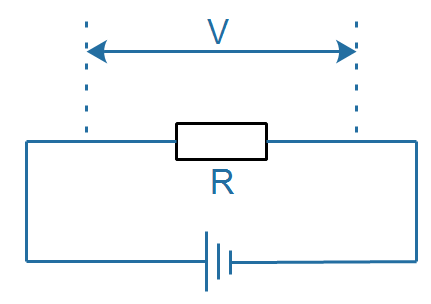
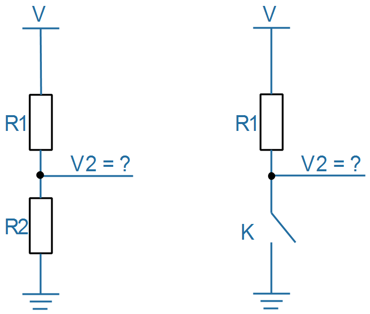
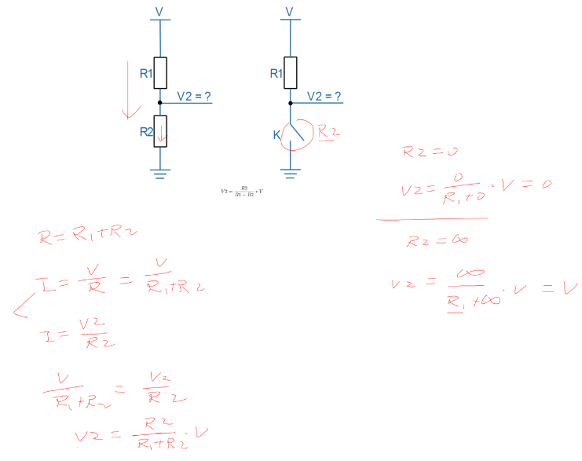
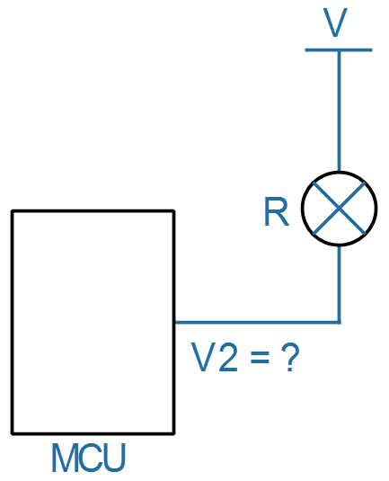
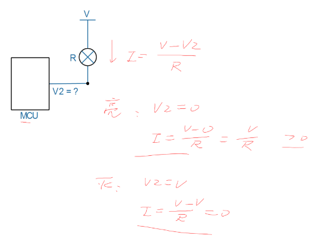
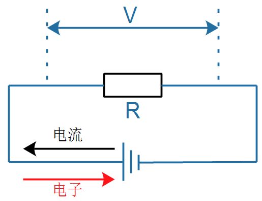
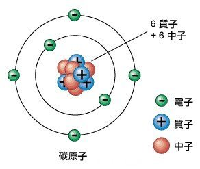

## 物理知识回顾

### 1. 欧姆定律



```shell
I = V/R
V = I*R
```


### 2. 扩展

#### 2.1 按键


$$
V2 = \frac{R2}{R1+R2}*V
$$

* 当R2=0，相当于开关K连接，V2=0
* 当R2断开，即R2=∞，相当于开关K断开，V2=V
* 如果我们能控制R2或K，就可以控制V2
* 怎么控制R2或K？可以用三极管

    

#### 2.2 灯



* I = (V - V2) / R

* MCU控制引脚输出低电平，V2=0，这时 I = V/R，灯亮

* MCU控制引脚输出高电平，V2=V，这时 I = 0，灯灭

    

### 3. 电流方向

在导线中流动的是电子，电子是负电荷，电流的方向与电子流动方向是相反的。




### 4. 原子结构

外围是电子(负电荷)，中间有质子(正电荷)：



有电流时，是电子在流动。


### 5. 扩散

物质会从浓度高的地方，向浓度低的地方扩散。

* 墨水放入水中就会散开

* 即使无风，气味也会散开

  