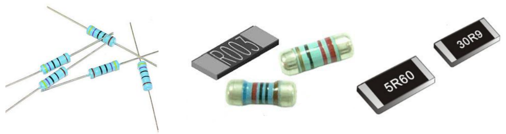

## 电路图概念

术语：

* sch：schematic，原理图
* PCB：Printed Circuit Board，印刷电路板
* footprint：脚印、足迹，表示元件在电路板上的外形
* component：元件图，电子元件的示意图

### 1. 实物

以LED为例，有多种多样的LED：有插针的，有贴片的

以电阻为例，有多种多样的电阻：

电源也有多种多样：

### 2. 实物连接

要点亮一个LED，怎么连线？用实物来描述的话，示例如下：

当我们更换元件，比如把LED换为贴片LED，难道连线图又要重新绘制吗？
不需要，我们首先抽象出元件图。

### 3. 元件图

#### 3.1 元件图示例

以LED为例，无论它的外形如何，都有共同点：有两个引脚(触点)，一正一负。
可以抽象出这样的图：

上面2个都可以用来表示LED，左边的形象。
如果你不想花时间绘制形象的元件图，可以使用类似右边的样例：重点在于引脚。

对于电阻、电源也有类似的元件图：

#### 3.2 芯片引脚标记

怎么表示一个芯片的引脚？可以通过引脚号(pin number)，也可以通过引脚名(pin name)。

举例：AT24C02实物图

查看它的芯片手册，可以看到引脚的描述图，如下：

在元件图里，pin number最重要，必须有pin number。但pin number並不能讓人理解功能
pin name可以省略，但是提供pin name可以让人容易理解。
比如EEPROM芯片的元件图：

* U1：位号，第1个元件。'U'一般用来表示元件，'R'表示电阻，'C'表示电容

* AT24C02A：芯片型号

  

### 4. 原理图

使用抽象出来的元件图，绘制得到的连线图，被称为**原理图**：

使用这样的原理图，可以应对不同外形的实物。

在原理图中，不方便连线时可以用**网络(net)節點**，比如下图：

* R1右边的引线放了一个net，名为：led_ctrl
* LED左边的引线也放了一个net，名字也是：led_ctrl
* 相同名字的net，表示它们之间是直接连在一起的

### 5. PCB封装图

原理图上只是把元件的连线绘制了出来，还需要解决这些问题：

* 元件长什么样？**贴片**的？还是**插脚**的？
* 元件摆放在电路板上什么位置
* 它们之间的连线多宽、形状、走向

比如下图是LED的PCB封装图：左边是贴片LED，右边是插针LED。

PCB上元件封装实物示例：

### 6. 设计电子产品的步骤

* 设计原理图
  * 根据功能决定使用什么芯片
  * 根据芯片手册绘制元件图
  * 把元件图摆出来，连接引脚
* 设计PCB图
  * 根据芯片手册绘制封装图
  * 布局：在PCB设计图上，根据原理图的元件清单，把对应元件的封装图摆放出来
  * 布线：在PCB设计图上，根据原理图里的连线，绘制电线连接元件
* 生产PCB
  * 为了不泄露设计，PCB图要转换为gerber文件
  * 把gerber文件发给PCB工厂
* 贴片/焊接
  * 购买元件
  * 在贴片厂进行焊接

### 7. 示例

概念：

* 元件图：把元件抽象出来，是一个示意图，主要关注它的引脚
* 原理图：元件之间怎么连线
* PCB封装图：元件引脚的外观
* PCB：最终的电路板

#### 7.1 原理图示例

有了元件图，我们可以把多个元件摆在一张图纸上，元件之间连线：得到原理图，比如：

#### 7.2 PCB图示例

有了PCB封装图，我们可以把原理图中各个元件摆放在PCB图上，根据原理图来绘制电线：得到PCB图。

#### 7.3 PCB实物示例

有了PCB图，就可以发给工厂生产，得到真实的电路板(PCB)：

#### 7.4 成品(焊接元件后)

把元件焊接到PCB上去之后，得到成品，如下：

