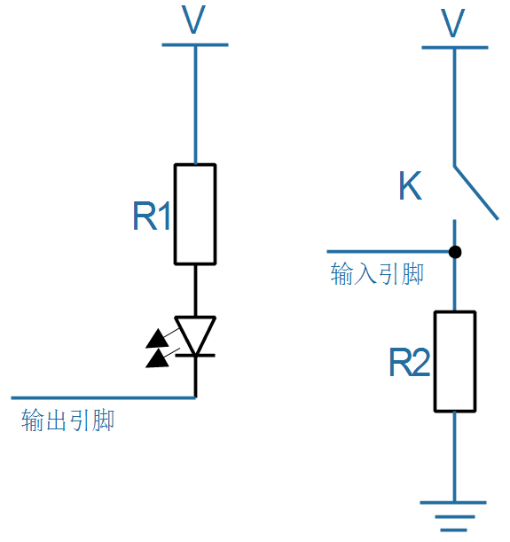
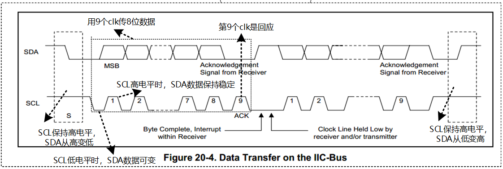
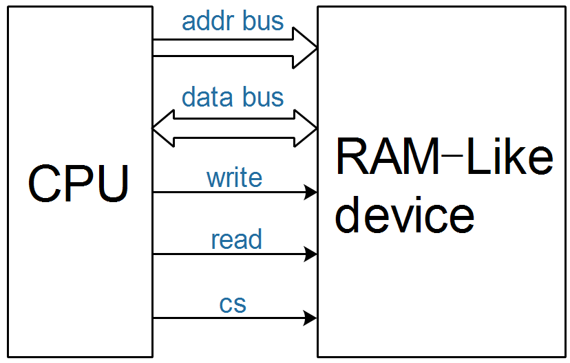
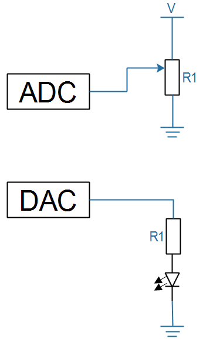

## 硬件接口的四大类

参考书籍：

* 《微机原理》：侧重于计算机结构
* 《数字电子技术基础 》：侧重于门电路

### 1. GPIO和門電路

GPIO：general peripheral input/ouput，通用的外设输入、输出接口。

这类电路通常只使用**一个引脚**：

* 可以设置为**输出**
  * 可以输出高、低电平
  * 比如用来控制LED
* 也可以设置为**输入**
  * 可以读取引脚电平，判断当前是高电平还是低电平
  * 比如用来判断按键是否被按下
* 可以接上各类晶体管(二极管、三极管等)实现逻辑运算

* 例子
  

**門電路**

- 用以實現**基本邏輯運算**和**複合邏輯運算**的**單元電路**稱為門電路。

- 常用的門電路在邏輯功能上有與門、或門、非門、與非門、或非門、與或非門、異或門等幾種。

- 它規定各個輸入信號之間滿足某種邏輯關係時，才有信號輸出，通常有下列三種門電路：與門、或門、非門（反相器）。
  - 從邏輯關係看，門電路的輸入端或輸出端只有兩種狀態，無信號以“0”表示，有信號以“1”表示
  - 低電平為“0”，高電平為“1”，稱為 **正邏輯**
  - 高電平為“0”，低電平為“1”稱為 **負邏輯**

### 2. 協議類

Note: 也是使用**一個引腳**

比如：UART、I2C、SPI、Nand、TFT LCD。
如果两个设备之间要传输的数据比较复杂，可以**约定一些规则**。这类接口被称为"协议类"接口。
当然可以只使用一条GPIO引脚来传输复杂的数据，比如红外遥控器、温度传感器等。
也可使用多条线路来传输数据，比如UART、I2C、SPI等。
比如TFT LCD的接口线将近30条。
例子：

* I2C接口

  * 硬件连接
    

  * I2C协议
    

### 3. 類似内存的接口(ram-like)

比如：Nor Flash、SDRAM、DDR、网卡DM9000等。

* 内存：可以读写某个地址上的数据，所以必定有这些信号
  * 地址总线(addr bus)
  * 数据总线(data bus)
  * 读/写信号(R/W)
  * 片选(cs)：ram-like接口上可以接多个设备，互相之间不能干扰，选中哪个设备哪个设备才能响应
* 很多设备也采用类似内存的接口，比如網卡、Nor Flash、8080接口的LCD
* 例子
  

### 4. 模擬电路

**數字(數位)電路**上传输的电压值只有2类取值，比如

* 2.xV到3.3V，抽象為 **邏輯值1**
* 0V到1.xV，抽象為 **邏輯值0**

**模擬(類比)电路**上传输的电压可以是各种各样的，比如以下两个电路：

* ADC電路中：`Analog -> Digital`，可以讀取滑動電阻器上的觸點電壓值
* DAC電路中：`Digital -> Analog`，可以輸出不同的電壓值，用來控制LED的亮度(數字電路里LED只有亮、滅兩個狀態)

