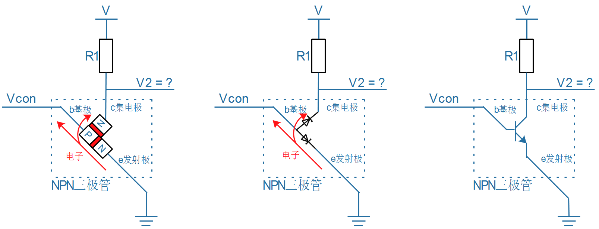

## GPIO與門電路

### 1. GPIO的應用

GPIO可以設置為輸出、輸入：

* 輸出功能

  * LED

  * 發射紅外信號

  * 控制電機

  * 蜂鳴器

  * 數碼管

* 輸入功能

  * 按鍵
  * 接收紅外信號
  * 人體感應
  
* 實現各類協議
  * 讀取溫濕度傳感器數據
  * 其實UART等也是使用GPIO來實現的

###  2. GPIO引腳操作

怎麼用一個GPIO來控制LED？換句話說，怎麼讓一個GPIO輸出高、低電平？

#### 2.1 設置引腳為GPIO功能 (GPIO功能暫存器)

芯片內部有很多模塊，比如GPIO、UART(串口)。
一個引腳，可以接到模塊A，也可以接到模塊B，比如上圖中的引腳gpio0_0，可以接到GPIO group 0，也可以接到UART。
可以設置某些**寄存器**(比如**io_mux**)，**選擇引腳的功能**。

#### 2.2 設置引腳方向 (GPIO方向暫存器)

假設一個引腳被設置成了GPIO功能，那麼它是用作輸出，還是輸入？
在GPIO模塊內部，一般都有一個**方向選擇寄存器**，裡面每一位用來控制一個引腳的方向。
比如GPIO group 0中有一個**gpio0_dir_reg寄存器**，

* 它的bit 0寫入1，表示gpio0_0被設置為輸出
* 它的bit 0寫入0，表示gpio0_0被設置為輸入

#### 2.3 設置/讀取引腳數值 (GPIO數據暫存器)

一個GPIO引腳被設置成輸出，那麼怎樣設置它的輸出電平？
一個GPIO引腳被設置成輸入，那麼怎樣讀取它的輸入電平？
在GPIO模塊內部，一般都有一個**數據寄存器**，裡面每一位用來控制一個引腳的輸出電平。
比如GPIO group 0中有一個**gpio0_data_reg寄存器**，

* 寫數據
  * 它的bit 0寫入1，表示gpio0_0輸出高電平
  * 它的bit 0寫入0，表示gpio0_0輸出低電平
* 讀數據
  * 如果bit 0等於1，表示gpio0_0為高電平
  * 如果bit 0等於0，表示gpio0_0為低電平

### 3. 二極管 - 兩個引腳

参考资料：[图文详解二极管原理](https://blog.csdn.net/u012184539/article/details/84869834)

* 二極管的箭頭表示**正向電流的方向**
* 二極管的電流具有**單向性**
* 假設正極、負極之間的電壓為V
  * 當V大於某個閾值(比如0.7V)，二極管就導通，導通時電阻約等於0
  * 當V<0，二極管不會導通，電阻無窮大
* 內部結構如下：由PN節組成，P代表正極(positive)，N代表負極(negative)
  

* 二極管中流動的是電子，電流方向是從正極到負極，電子流動的方向是從負極到正極

* 使用二極管

  * 比如：**使用二極管防止電源接反是燒壞電路**

  

### 4. 三極管 - 三個引腳

参考资料：[三极管工作原理分析精辟透彻看后你就懂](https://wenku.baidu.com/view/14bf31be81d049649b6648d7c1c708a1284a0abb.html)

可以使用二極管的特性製作成三極管，組成開關電路。

三極管實物圖：

三極管可以分為：NPN三極管、PNP三極管。

發射區(E)、基區(B)、收集區(C)

為一個**反向器**

#### 4.1 NPN三極管

* 擴散
  * 物質會從濃度大的地方擴散到濃度低的地方
  * 比如墨水滴入水中，墨水會四處散開
  * 比如臭味會四處散開
  * 電子也會有擴散作用
* 三極管原理
  * 當**be之間的PN節加上正向電壓**，電子從e極的'N'大量往‘P’移動(所以e被稱為發射極)
  * 電子在'P'大量聚集，一部分通過b極流走，另一部分通過c極擴散出去(c起收集作用，所以被稱為集電極)
    * 電子流動方向如圖中紅色箭頭所示
    * 電流方向與電子流動方向相反：be之間電流從b到e，ce之間電流從c到e
* 三極管的使用
  * 當Vcon等於0.7V左右，be之間的PN節打通，c極相當於直接連接e，V2=0
  * 當Vcon等於0V，be之間的PN節沒打通，c極相當於斷開，V2=V
  * 所以，可以用Vcon來控制V2

* **BE導通，則CE導通**

#### 4.2 PNP三極管

* 擴散
  * 物質會從濃度大的地方擴散到濃度低的地方
  * 比如墨水滴入水中，墨水會四處散開
  * 比如臭味會四處散開
  * 電子也會有擴散作用
* 三極管原理
  * 當**eb之間的PN節加上正向電壓**，空穴從e極的'P'大量往'N'移動(所以e被稱為發射極)
  * 空穴在'N'大量聚集，一部分通過b極流走，另一部分通過c極擴散出去(c起收集作用，所以被稱為集電極)
    * 空穴流動方向如圖中紅色箭頭所示
    * 電流方向與空穴流動方向相同：eb之間電流從e到b，ec之間電流從e到c
* 三極管的使用
  * 當Vcon為低電壓(比如0V)，eb之間的PN節打通，c極相當於直接連接e，V2=V
  * 當Vcon等於高電壓(比如3.3V)，eb之間的PN節沒打通，c極相當於斷開，V2=0(通過電阻接地)
  * 所以，可以用Vcon來控制V2

* **BE導通，則CE導通**
