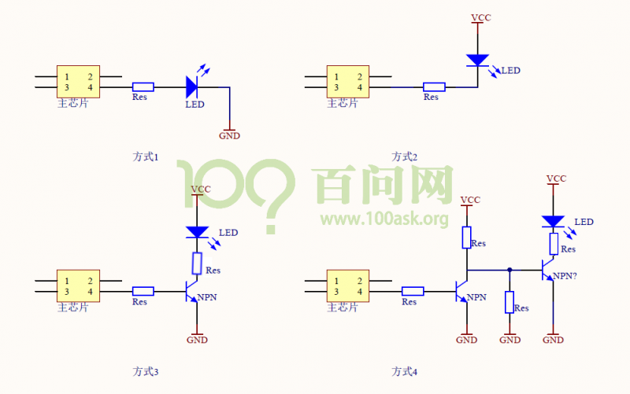

## LED電路與操作

### 1. LED實物

* 發光二極管(體)

  

### 2. LED電路

* 方式1
  * 芯片引腳輸出高電平，LED被點亮
  * 芯片引腳輸出低電平，LED被熄滅
  * 缺點：芯片引腳的驅動能力可能不夠，LED亮度低
  * 原因：直接流過LED的電流較大，芯片驅動裡可能不夠
* 方式2
  * 芯片引腳輸出低電平，LED被點亮
  * 芯片引腳輸出高電平，LED被熄滅
  * 缺點：電流進入芯片過大時，可能燒毀芯片
  * 原因：電流改由電源提供，但電流可能會過大，燒毀芯片
* 方式3
  * 芯片引腳輸出高電平，三極管(NPN)導通，發光二極體導通，LED被點亮
  * 芯片引腳輸出低電平，三極管(NPN)不導通，發光二極體不導通，LED被熄滅
* 方式4
  * 芯片引腳輸出低電平，第一個三極管不導通，第二個三極管導通，LED被點亮
  * 芯片引腳輸出高電平，第一個三極管導通，第二個三極管不導通，LED被熄滅

