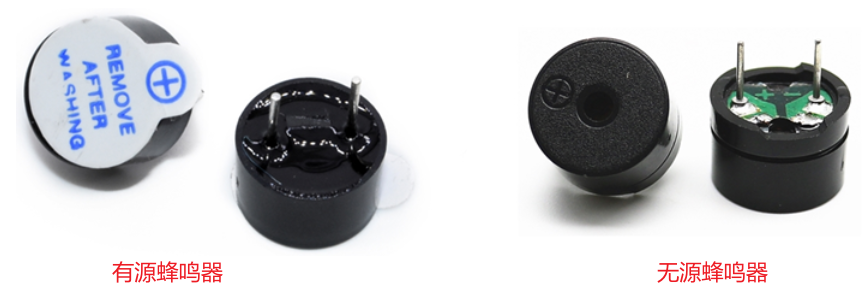
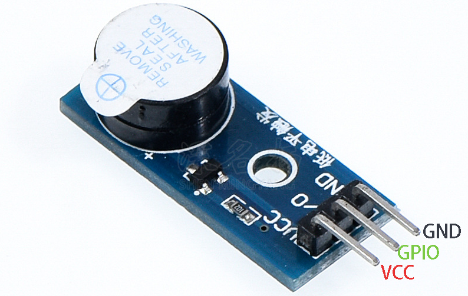

## 蜂鳴器電路與操作

### 1. 蜂鳴器

蜂鳴器是一種常見的電子發聲元器件，採用**直流電壓**供電，廣泛應用於計算機、打印機、報警器、電子玩具、汽車電子設備等產品中。

常見的蜂鳴器可分為有源蜂鳴器和無源蜂鳴器，這裡的"源"不是電源，而是**震盪源**：

* 有源蜂鳴器：內部有震盪源，只要通電即可自動發出固定頻率的聲音。
* 無源蜂鳴器：內部無震盪源，單是通電並不會發聲，需要使用周期性的脈衝才可以發聲，聲音頻率可變。

兩種蜂鳴器實物如下圖所示，從外觀上來看兩種蜂鳴器形狀相似：

* 有源蜂鳴器底部有黑膠密封
* 無源蜂鳴器底部可看到電路板（圖中綠色部分）
* 兩種蜂鳴器都標註有正負極

### 2. 蜂鳴器電路

下圖是一個有源蜂鳴器模塊：

它的原理圖如下：

* 當GPIO為低電平時，PNP三極管導通，蜂鳴器正極電壓等於VCC，蜂鳴器發出聲音。
* 當GPIO為高電平或懸空時，PNP三極管不導通，蜂鳴器正極電壓相當於沒接線，蜂鳴器不會發出聲音。

