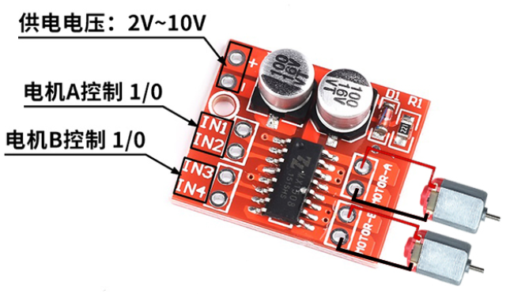
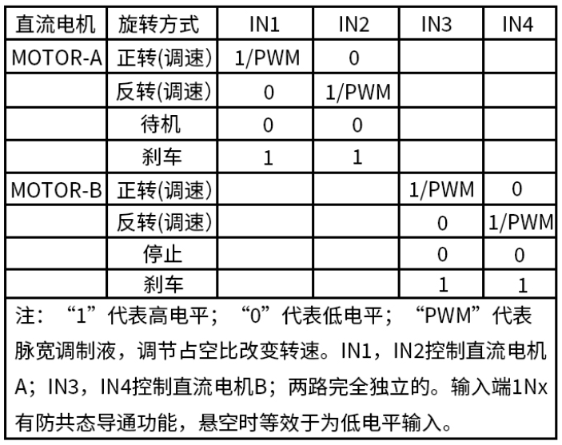
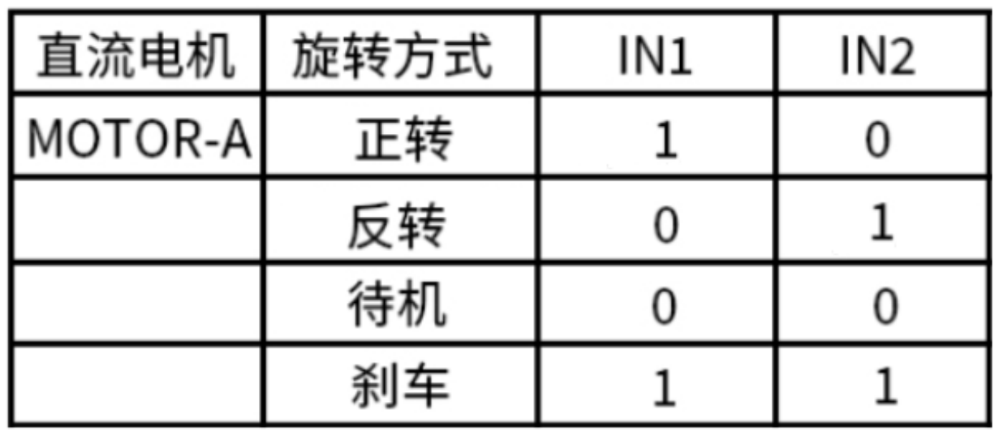
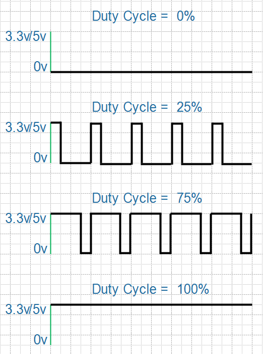
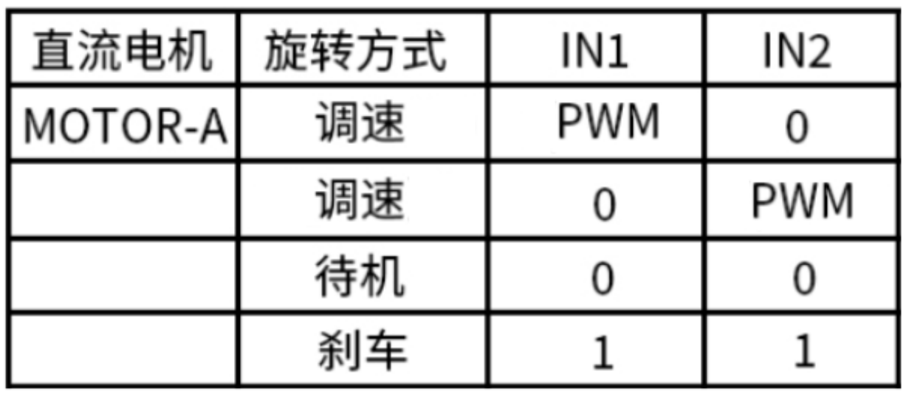

## 電機驅動板

### 1. 電機驅動板接口與操作方法

電機驅動板接口如下：

它可以用來控制2個馬達：

* IN1和IN2用來控制motor-A
* IN3和IN4用來控制motor-B

控制馬達時，可以讓它正轉、反轉、待機、剎車，控制信號如下圖所示：

### 2. 控制一個馬達

#### 2.1 接線

* 電源：把電源接到板子的"+"、"-"引腳
* 馬達：把馬達接到motor-A的連個引腳
* 控制信號：使用兩個GPIO接到IN1、IN2

#### 2.2 使用高低電平控制

使用高低電平進行控制時，正轉或反轉時，電機使用的是最高的速度。
如果想調整速度，需要使用PWM波。

#### 2.3 使用PWM控制速度

PWM：Pulse width modulation，脈衝寬度調製。簡單地說就是周期性地輸入高低電平，得到如下波形：

在一個週期中，高電平的時間佔比被稱為"佔空比"：

* 當佔空比為0時，表示引腳輸出恆為低電平
* 當佔空比為100%時，表示引腳輸出恆為高電平

在點擊控制板的IN1、IN2引腳上輸入PWM波，就可以控制電機的速度。簡單地說就是：一會讓電機運轉、一會讓電機停止，調整運轉和停止的比列就可以控制速度。由於運轉、停止的間隔時間太短以致人們感覺不到馬達有停頓。

