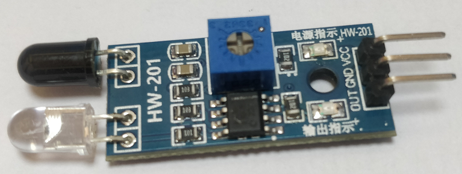

## 紅外避障傳感器模塊

# 1. 模塊介紹

紅外避障傳感器具有一對紅外線發射與接收管，工作原理為：

* 發射管發射出一定頻率的紅外線
* 當檢測方向遇到障礙物（反射面）時，紅外線反射回來被接收管接收
* 正前方有障礙物時，**綠燈亮起，OUT引腳為低電平**；反之，**綠燈熄滅，OUT引腳為高電平**

缺點：由於日光是也含紅外線，所以大多數便宜的紅外模塊在戶外使用就會遇到問題。

### 2. 使用

通過VCC、GND給模塊供電，供電電壓為3.3V~5V。

**讀取OUT引腳電平即可判斷前方是否有障礙物**，可以旋轉模塊上的電阻器來調節閾值。

