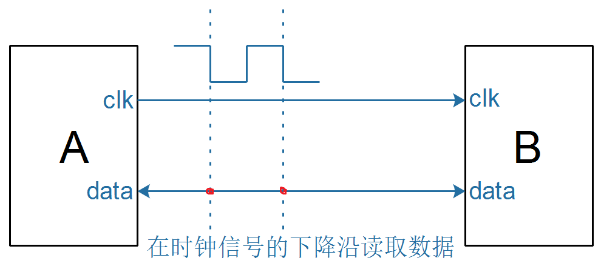
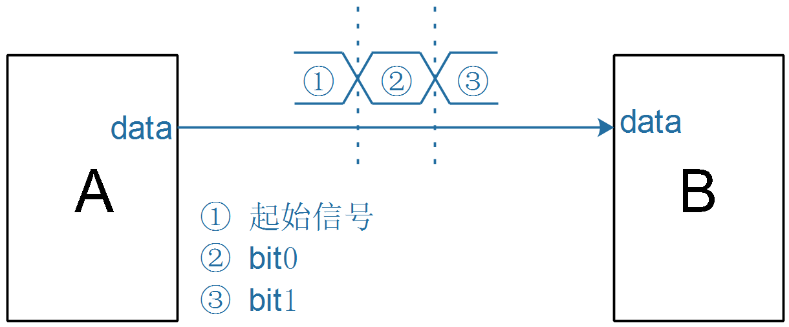
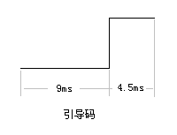
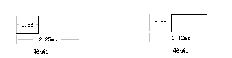

## 同步與異步

### 1. 概念

同步(**synchronous**)、異步(**asynchronous**)，使用生活例子來說就是：

* 同步：朋友打電話說到我家吃飯，我在家裡等他們
* 異步：朋友沒有提前打招呼，突然就到我家來了

#### 1.1 同步信號示例

在電子產品中，使用**同步信號**進行傳輸時，一般涉及兩個信號：

* 時鐘信號：用來通知對方要讀取數據了
* 數據信號：用來傳輸數據

比如：

* 時鐘信號：打電話，起約定作用
* 數據信號：傳輸數據

#### 1.2 異步信號示例

使用異步信號傳輸數據時，雙方遵守相同的約定：

* 起始信號：發送方可以通知接收方"注意了，我要開始傳輸數據了"

* 數據的表示

  * 怎麼表示邏輯1
  * 怎麼表示邏輯0

以紅外遙控器解碼器為例，它向單片機發出的數據格式如下：

* 起始信號：解碼器發出一個9ms的低電平、4.5ms的高電平，用來同時對方說"開始了"
  
  

* 表示一位數據

  * 邏輯1：0.56ms的低電平+1.69ms的高電平
  * 邏輯0：0.56ms的低電平+0.56ms的高電平

  

* 接收方、發送方都遵守這樣的約定，就可以使用一條線傳輸數據

### 2. 差別

|            | 同步傳輸                   | 異步傳輸           |
| ---------- | -------------------------- | ------------------ |
| 信號線     | 多：時鐘信號、數據信號     | 少：只需要數據信號 |
| 速率       | 可變，提高時鐘信號頻率即可 | 雙方提前約定       |
| 抗干擾能力 | 強                         | 弱                 |