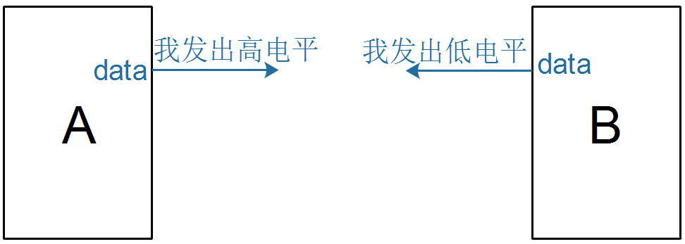
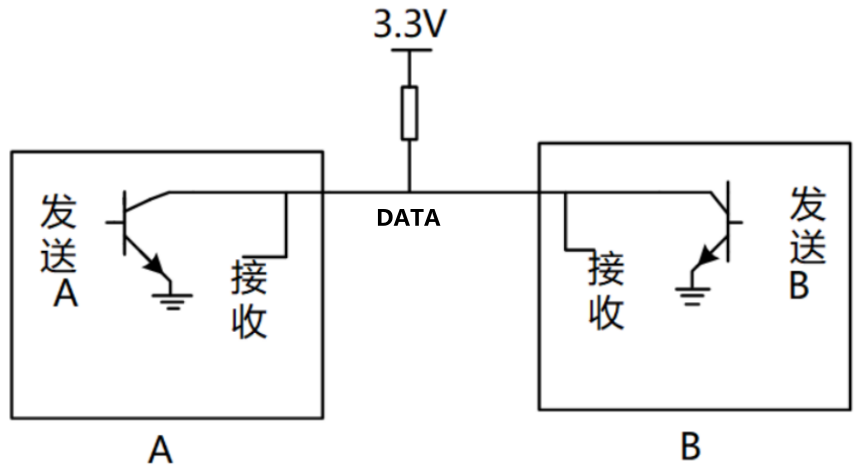
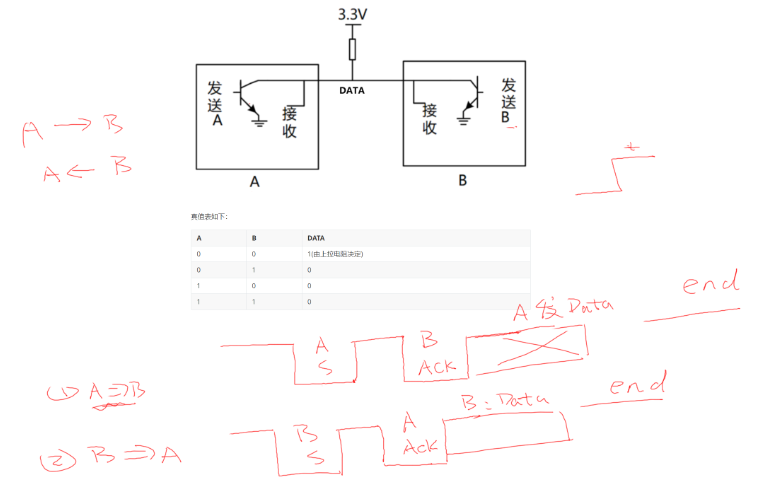

## 使用一線傳輸雙向數據

### 1. 面臨的問題

兩個設備之間，只使用一條數據線，能否傳輸雙向的數據？

* A發出高電平，B發出低電平
  * 電路可能被損壞
  * 電路上到底是高電平還是低電平？不能確定
* 問題在於：有兩個設備試圖**同時驅動**電路

### 2. 解決方法

不讓雙方**同時驅動**電路，或者即使**同時驅動**也沒關係：

* 不讓雙方**同時驅動**電路：雙方無法約定時間，此方法不可行
* 即使**同時驅動**也沒關係：可行，透過硬體設計，電路如下：
  * A, B內部都配有一個三極體(反向器)

真值表如下：

| A    | B    | DATA              |
| ---- | ---- | ----------------- |
| 0    | 0    | 1(由上拉電阻決定) |
| 0    | 1    | 0                 |
| 1    | 0    | 0                 |
| 1    | 1    | 0                 |

從真值表和電路圖我們可以知道：

* 當某一個芯片不想影響SDA線時，那就不驅動這個三極管
* 想讓DATA輸出高電平，雙方都不驅動三極管(SDA通過上拉電阻變為高電平)
* 想讓DATA輸出低電平，就驅動三極管

芯片內部的三極管，被稱為**open collector**，**開集**，也就是在芯片內部三極管的集電極是開放的。
芯片內部不驅動三極管是，集電極的電平由外面的**上拉電阻**決定。

這種電路實現了：

* 雙方設備即使同時想輸出不同的電平：
  * 電路也不會被損壞
  * 電平也是確定的

### 3. 雙向傳輸示例

* 初始狀態：一開始，雙方都不驅動三極管，DATA為高
* 起始信號和回應：A想傳輸數據給B，發出開始信號、得到回應信號
  * A檢測DATA線，高表示對方沒有佔用數據線
  * A驅動三極管，使得DATA為低，用來通知B：我就要傳輸數據了
  * A釋放三極管，DATA變為高
  * B驅動三極管，使得DATA為低，用來通知A：好的，我準備好了(這是一個回應信號)
  * B釋放三極管，DATA變為高

* 傳輸：A發送數據給B，比如傳輸2位數據0、1
  * 雙方都使用同一套數據表示方法，比如使用60US來傳輸一位數據，數值由DATA電平決定
  * 在第1個60us，A設置DATA為低；在同一時間，B讀取DATA電平得到數據0
  * 在第2個60us，A設置DATA為高；在同一時間，B讀取DATA電平得到數據1

* 結束：A釋放三極管，DATA變為高電平
* 這時候，B也可以使用一樣的方法給A傳輸數據