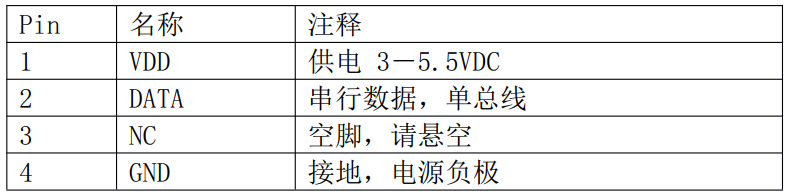
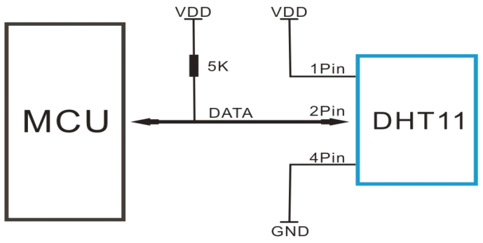
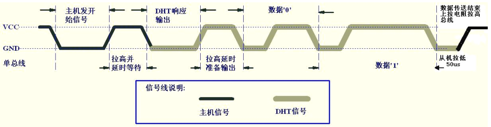
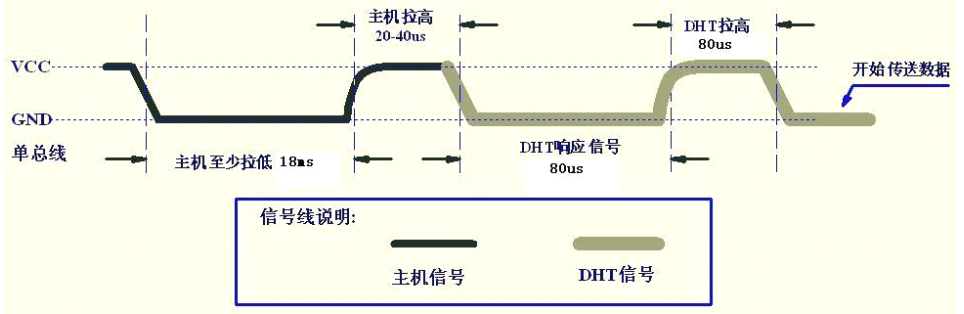
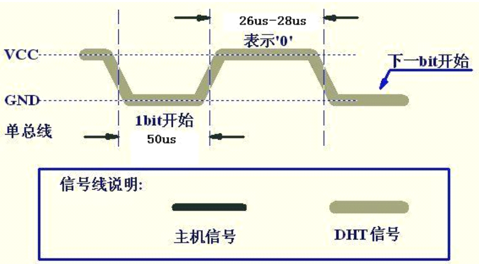
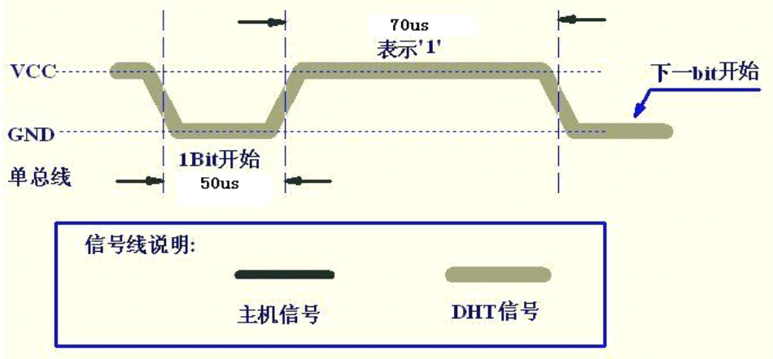

## DHT11溫濕度傳感器

參考資料：GIT倉庫

* [DHT11-chinese(U3).pdf](../datasheet/DHT11-chinese(U3).pdf)

### 1. 芯片介紹

簡單地說，可以從DTH11中讀取到溫度值、濕度值。外形及引腳如下：

典型應用電路如下：

### 2. 數據格式

DHT11的data引腳用戶傳輸數據，一次通訊時間為4ms作用，數據分為：整數部分、小數部分。
目前小數部分用具以後擴展，現讀出為0。
一次完整的數據為40 bit，先傳輸高位：

* 格式為：8bit濕度整數數據 + 8bit濕度小數數據 + 8bit溫度整數數據 + 8bit溫度小數數據 + 8bit校驗和
* 校驗和 = "8bit濕度整數數據 + 8bit濕度小數數據 + 8bit溫度整數數據 + 8bit溫度小數數據" 所得結果的低8位

### 3. 通信協議

* 平時，DHT11處於低功耗模式

* MCU發送開始信號，讓DHT11從低功耗模式轉換為高速模式

* DHT11等待主機開始信號結束後，會發送響應信號

* DHT11發送40bit數據

* 通信過程如下：

  

#### 3.1 開始信號

* 總線空閒狀態位高電平
* 主機把總線拉低等待DHT11響應，主機把總線拉低必須大於18ms，保證DHT11等檢測到開始信號
* DHT11接收到主機的開始信號後
  * 等待主機開始信號結束：主機要把信號拉高20-40us
    * 主機輸出高電平，或者引腳設置為輸入模式(通過上拉電阻拉高)
  * DHT11發送80us低電平響應信號
  * DHT11發送80us高電平

DHT11發送響應信號後，再把總線拉高80us，準備發送數據。
每一bit數據都以50us低電平時隙開始，高電平的長短用來分辨是數據0還是1。

#### 3.2 數據0

#### 3.3 數據1

### 4. 編程要點

數據0的高電平是26-28us，數據1的高電平是70us，兩者只有40us左右的差別。
編程的要點在於：能分辨出這40us的差別。
需要一個高精度的定時器，能實現us級別的延遲。

