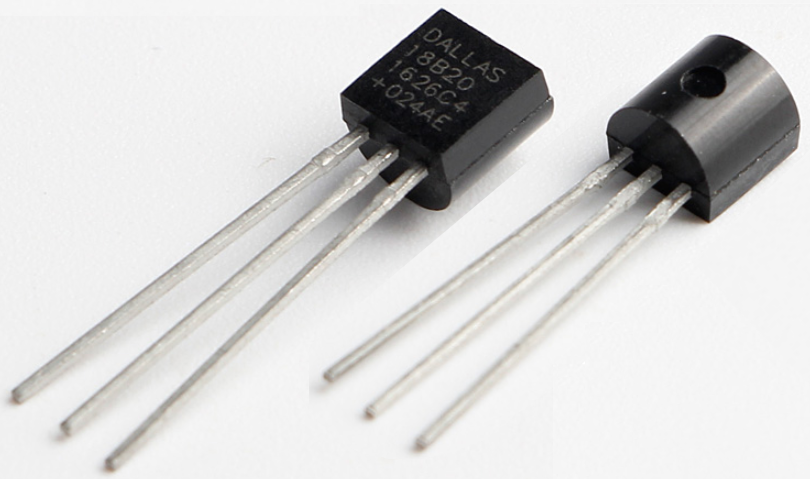
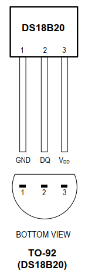
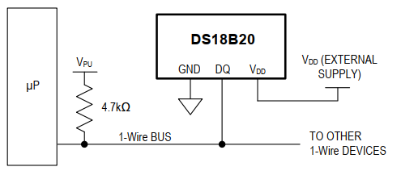
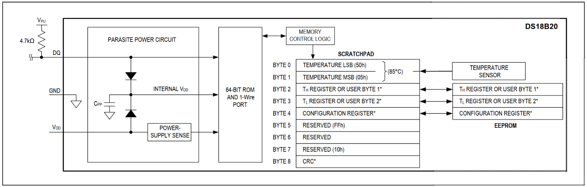
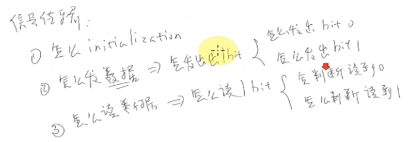
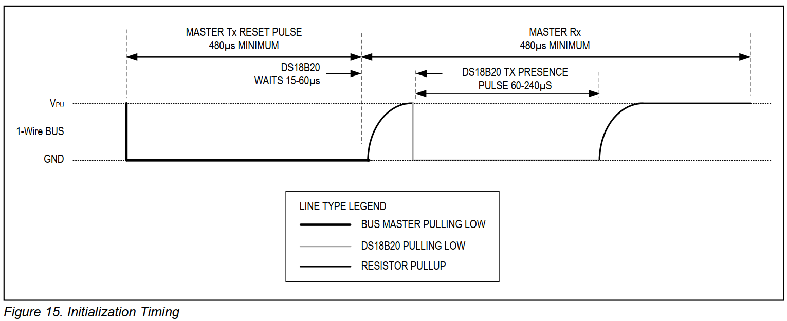
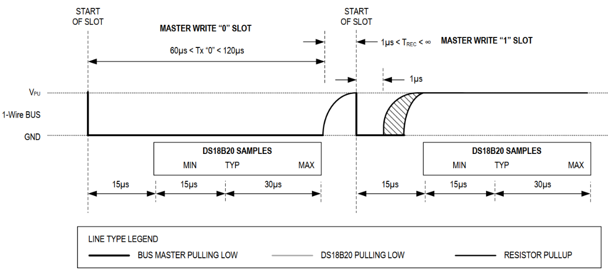
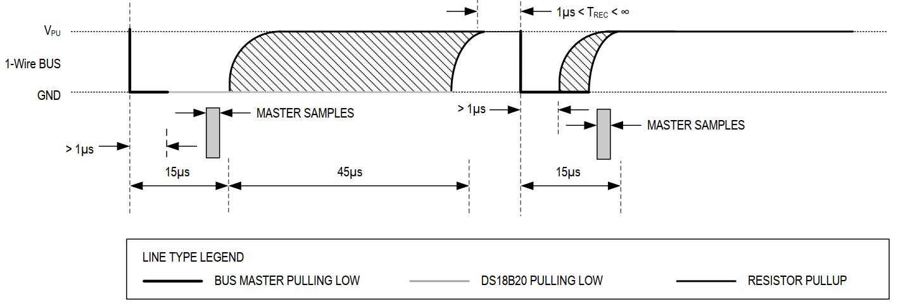
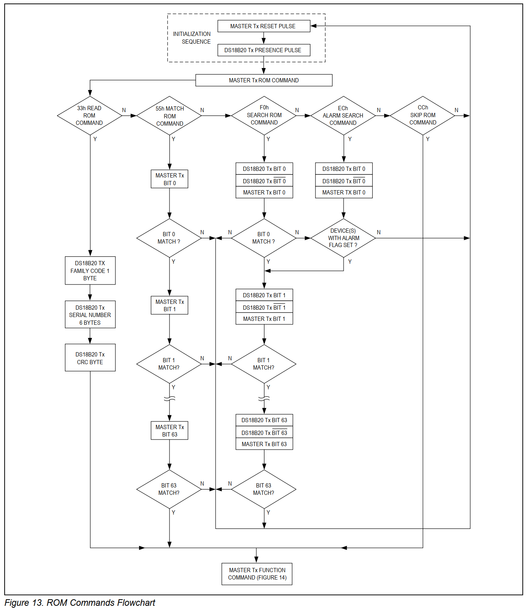
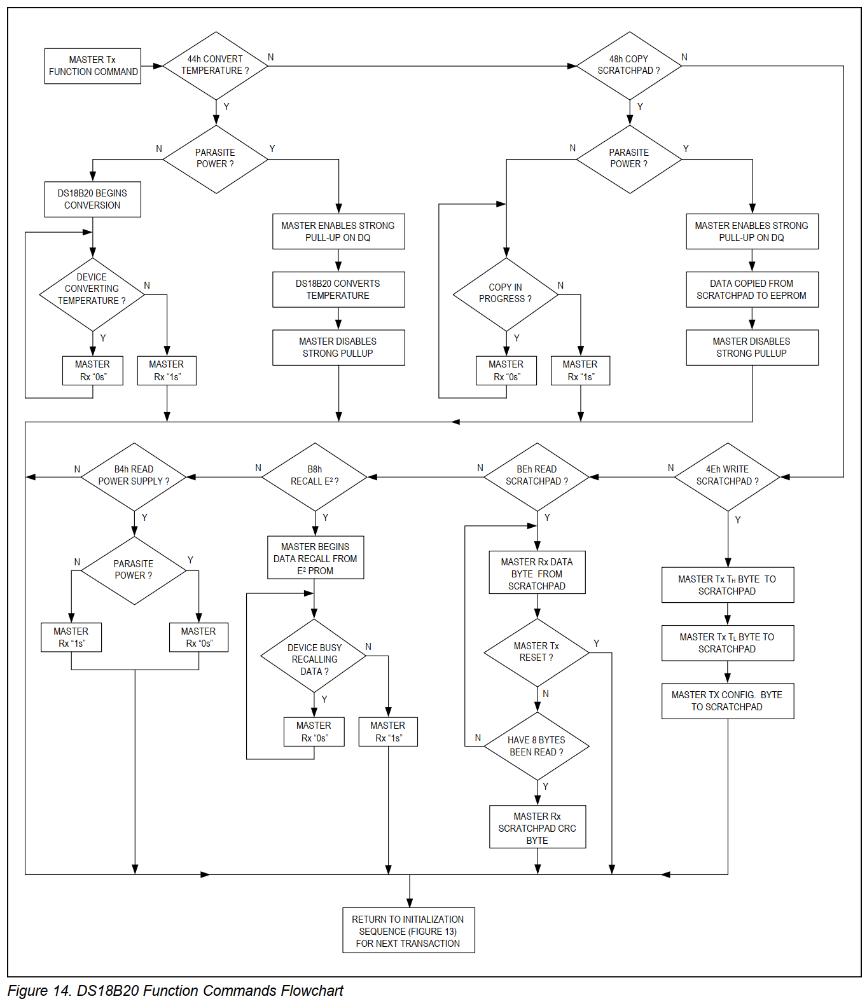

## DS18B20温度传感器

参考资料：GIT仓库

* [DS18B20(U2_TO-92).pdf](../datasheet/DS18B20(U2_TO-92).pdf)

### 1. 芯片介绍

DS18B20是高精度温度传感器，比DHT11精度高。DS18B20内部有一个64位的ID (64bits ROM)，可以使用一条线连接多个DS18B20，通过ID来访问分辨、访问某个DS18B20。这使得可以在一个很大的区域里布置多个DS18B20，而只需要一个控制器就可以控制它们。
外形及引脚如下：

典型應用電路如下：

### 2. 訪問方法概述

一個處理器可以使用一條IO線連接多個DS18B20，問題來了：怎麼訪問某個DS18B20？

* DS18B20內部有ID，每個芯片的ID都不一樣
* 理論上一條線上可以掛無數個DS18B20，為了省點，它們平時都是休眠的，要喚醒才能工作
* 處理器要訪問某個DS18B20時
  * 初始化：發出脈衝提醒要工作了，喚醒線路上的DS18B20
  * 發出**ROM命令**：想訪問哪個DS18B20
  * 發出**功能命令(Function Command)**：要幹嘛(比如啟動溫度轉換、讀內存)
* 每次訪問須依序 **初始化 -> ROM命令 -> Function Command**

#### 2.1 ROM命令 (ID命令)

| ROM Commands |  命令名稱  |                             描述                             |
| :----------: | :--------: | :----------------------------------------------------------: |
|     F0H      | Search ROM | 搜索ROM 用於確定掛接在同一總線上DS18B20的個數，識別64位ROM地址 |
|     33H      |  Read ROM  |          讀ROM 讀DS18B20芯片中的編碼值，即64位ROM值          |
|     55H      | Match ROM  | 匹配ROM 發出此命令後，接著發出64位ROM編碼，用於選中某個設備  |
|     CCH      |  Skip ROM  | 忽略ROM 表示後續發出的命令將會發給所有設備 如果總線上只有一個DS18B20，則特別適用此命令 |
|     ECH      | Alarm ROM  | 警報搜索 執行此命令後，只有溫度超過設定值上限或下限的芯片才會做出響應 |

#### 2.2 功能命令

| Function Commands |       命令名稱       |                             描述                             |
| :---------------: | :------------------: | :----------------------------------------------------------: |
|        44H        | Convert Teamperature | 啟動溫度轉換，注意不同精度需要不同轉換時間，結果存入內部RAM  |
|        4EH        |   Write Scratchpad   | 寫內部RAM，可以寫入3字節：TH，TL，配置值(用於選擇精度)TH，TL可用於設置報警上下限，或給用戶自己使用 |
|        BEH        |   Read Scratchpad    |                     讀整個內部RAM，9字節                     |
|        48H        |   Copy Scratchpad    |          把內部RAM中的TH、TL、配置值，複製給EEPROM           |
|        B8H        |    Recall EEPROM     |           從EEPROM中把TH、TL、配置值，讀到內部RAM            |
|        B4H        |  Read Power Supply   |    分辨DS18B20的供電方式：用電源引腳供電，或從數據線偷電     |

### 3. 內部結構

DS18B20內部：

* 有64位的ROM，用來存儲ID
* 9byte的 scratchpad，也就是內存，從來保存溫度值等
* 溫度傳感器(temperature sensor)，它是一個ADC，採樣溫度並轉換為數值
* EEPROM：**2字節用來保存報警溫度的上限、下限**，1字節用來保存配置信息(ADC精度)
  * 上電時會把ROM的數值傳遞給對應的RAM
  * Write EEPROM: 先寫RAM再寫入EEROM
  * Read EEPROM: EEPROM先讀至RAM，再讀RAM

以讀取溫度為例：

* 啟動溫度轉換
  * 初始化
  * 發出ROM命令選擇要訪問的DS18B20
  * 發出功能命令0x44，啟動溫度轉換
* 等待溫度轉換完畢，溫度值會放入scratchpad的byte0、byte1
  * DS18B20內部在進行溫度採集、ADC轉換期間，會把數據線拉低
  * 當讀數據線為高電平時，表示溫度轉換完畢
* 讀取溫度值
  * 初始化
  * 發出ROM命令選擇要訪問的DS18B20
  * 發出功能命令(0xBE)，讀取scratchpad
* 如果只有一個DS18B20，發出的ROM命令可以是0xCC，表示“skip rom”，忽略ID，訪問所有的設備

### 4. 通信協議

#### 4.1 初始化

數據線一開始是高電平，控制器想要開始傳輸信號時：

* 先拉低數據線至少480us，然後釋放總線
* 經過15\~60us之後，DS18B20會把這條線拉低60\~240us，這是回應信號

#### 4.2 寫1位數據

控制器向DS18B20發出1位數據，消耗的時間是60us~120us，被稱為slot，時隙。

* 寫0

  * 控制器發出15us的低電平，提醒DS18B20：我要發數據了
  * 在後續的45us內，控制器都保持數據線為低電平

* 寫1

  * 控制器發出15us的低電平，提醒DS18B20：我要發數據了

  * 在後續的45us內，控制器設置數據線為高電平

* 位間隔：至少1us

#### 4.3 讀1位數據

控制器讀取DS18B20的1位數據，消耗的時間是60us~120us，被稱為slot，時隙。

* 讀出的數據是0

  * 控制器發出15us的低電平，提醒DS18B20：我要讀數據了
  * 在這15us內，DS18B20把數據線驅動為低電平
  * 在後續的45us內，控制器讀取數據線得到0

* 讀出的數據是1

  * 控制器發出15us的低電平，提醒DS18B20：我要讀數據了
  * 在這15us內，DS18B20把數據線驅動為高電平
  * 在後續的45us內，控制器讀取數據線得到1

* 位間隔：至少1us

#### 4.4 流程圖

芯片手冊13、14頁。

ROM命令流程圖：

功能命令流程圖：

