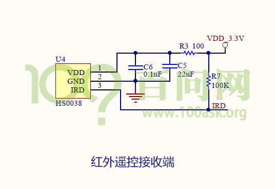
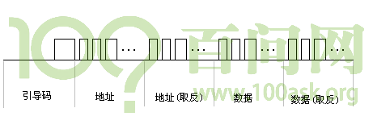
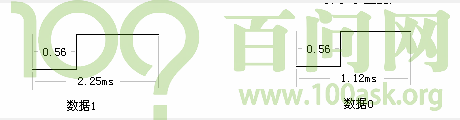
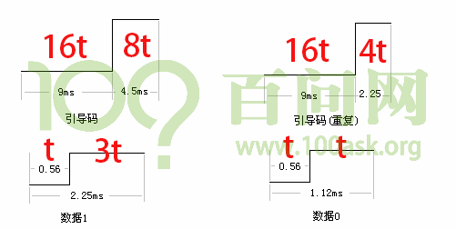
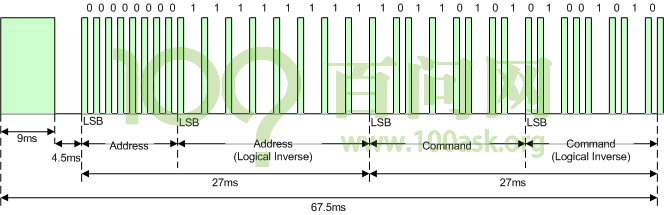

## 紅外線遙控協議簡介及編程思路 

### 1. 硬件原理圖

首先看一下原理圖上的紅外遙控接收器：

我們用遙控器對它按動的時候，它就可以接收到**紅外信號**，然後把紅外信號轉換成**電平信號**，通過**IRD**這根線，傳給SOC。
整個傳輸，只涉及單向傳輸，由HS0038向主芯片傳送。
因此，我們只需要編寫程序，從IRD上獲取數據即可，在這之前，我們需要先了解下數據是怎麼表示的，也就是傳輸的紅外數據的格式。

### 2. NEC協議

紅外協議有：NEC、SONY、RC5、RC6等，常用的就是NEC格式，因此我們主要對NEC進行講解。

可以參考這個文章，直觀的了解下NEC格式波形的樣子：https://www.cnblogs.com/openusb/archive/2010/01/07/1641357.html
在分析文章中的波形之前，我們先想像一下怎麼在一條數據線上傳輸信號。
開始傳輸數據之前，一般都會發出一個start起始信號，通知對方我開始傳輸數據了，後面就是每一位每一位的數據。
NEC協議的開始是一段引導碼：

這個**引導碼**由一個9ms的低脈衝加上一個4.5ms的高脈衝組成，它用來通知接收方我要開始傳輸數據了，如下圖所示：

然後接著的是**數據**，數據由4字節組成：**地址、地址(取反)、數據、數據(取反)**，這些取反是用來校驗用的。
地址是指遙控器的ID，每一類遙控器的ID都不一樣，數據就是遙控器上的不同按鍵。
從前面的圖可以知道，NEC每次要發32位的數據，每一位用什麼來表示0和1呢？如下圖所示：

數據1和0，開始都是0.56ms的低脈衝，對於數據1，後面的高脈衝比較長，對於數據0，後面的高脈衝比較短。
可以看出，紅外遙控器的數據表示方法是比較簡單的。

我們長按一個按鍵，第一次按的時候，他會發出引導碼，地址，地址取反，數據，數據取反。
接著由於長按，遙控器會發送一個不一樣的引導碼，這個引導碼由9ms的低脈衝，2.25ms的高脈衝組成，表示現在按的還是上次一樣的按鍵，然後再一直是引導碼(重複)，直到鬆開。
引導碼(重複)格式如下圖所示：

在後面的調試中，發現以上並不是NEC協議的全部，打開bing國際版搜索“ir nec protocal”，得到一篇官方文章：http://techdocs.altium.com/display/FPGA/NEC+Infrared+Transmission+Protocol
裡面的內容和前面文章基本一致，但這個更詳細，發現每次數據傳輸完還有一個0.5625ms的低脈衝表示數據傳輸結束。
對於引導碼(重複)也一樣，也有一個0.5625ms的低脈衝表示傳輸結束。
大部分文章都漏掉了結束的低脈衝。

NEC協議裡有很多時間，這些時間有一個有趣的現象，把所有時間裡面最小的0.53ms看作基本脈衝寬度，假設用t表示，那麼其它所有時間都是t的倍數，如下圖所示：

我們可以看到對於所有的時間，最小的單位都是0.56ms，這個時間對人來說是非常短的，但對嵌入式系統它是非常非常長的了，足夠我們做很多事情了，那麼我們可以使用中斷來處理這些數據。
並且對於紅外遙控器來說，我們根本不知道用戶什麼時候按下遙控器，使用輪詢的方式特別耗資源，因此直接使用中斷來處理。

使用官方文檔的時序圖：

圖中的脈衝方向正好相反，綠色表示低脈衝，白色表示高脈衝。
涉及內容：
①中斷引腳設置為**雙邊緣觸發**，在每一個脈衝變化的地方都會產生中斷；
②發生中斷時，計算當前中斷與上次中斷之間的時間差，就得到**脈衝寬度**，放入buffer，同時還要記錄**引腳極性**；
③主循環**從buffer取出數據，並解析時序**；

### 3. 編譯方法

我們可以估算下，每按下一次遙控器，會產生多少中斷，2+32*2+1=67次。
中斷發生時，將數據放入buffer，主函數從buffer取出數據，用什麼數據結構來實現數據的存取？
最好的方式就是環形緩衝區，所謂環形緩衝區就是一邊存儲數據一邊讀取數據，下節課再詳細講解。

編程要點：
①中斷
②系統時間
③環形緩衝區
④NEC解析