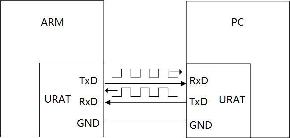

## 硬件知識_UART硬件介紹

### 1. 串口的硬件介紹

UART的全稱是**Universal Asynchronous Receiver and Transmitter**，即異步發送和接收。
串口在嵌入式中用途非常的廣泛，主要的用途有：

* **打印調試信息**；
* **外接各種模塊**：GPS、藍牙、Radar；

串口因為結構簡單、穩定可靠，廣受歡迎。

通過三根線即可，發送、接收、地線。

通過TxD->RxD把ARM開發板要發送的信息發送給PC機。
通過RxD->TxD線把PC機要發送的信息發送給ARM開發板。
最下面的地線統一參考地。

### 2. 串口的參數

- 波特率：一般選波特率都會有9600,19200,115200等選項。其實意思就是每秒傳輸這麼多個比特位數(bit)。
- 起始位:先發出一個邏輯”0”的信號，表示傳輸數據的開始。
- 數據位：可以是5~8位邏輯”0”或”1”。如ASCII碼（7位），擴展BCD碼（8位）。小端傳輸。
- 校驗位：數據位加上這一位後，使得“1”的位數應為偶數(偶校驗)或奇數(奇校驗)，以此來校驗數據傳送的正確性。
- 停止位：它是一個字符數據的結束標誌。

    

- 縮寫: 115200, 8n1 ---> baudrate=115200, 8bits Data, n 沒有校驗位, 1 停止位為high

**怎麼發送一字節數據，比如‘A‘?**

‘A’的ASCII值是**0x41**,二進制就是**01000001**，怎樣把這8位數據發送給PC機呢？

* 雙方約定好波特率（每一位(bit)佔據的時間）；

* 規定傳輸協議

  *  **原來是高電平，ARM拉低電平，保持1bit時間**；
  *  PC在低電平開始處計時；
  *  ARM根據數據依次驅動TxD的電平，同時PC依次讀取RxD引腳電平，獲得數據；

  

前面圖中提及到了邏輯電平，也就是說代表信號1的引腳電平是人為規定的。
如圖是**TTL/CMOS邏輯電平**下，傳輸‘A’時的波形：

* 在xV至5V之間，就認為是邏輯1
* 在0V至yV之間就為邏輯0

如圖是**RS-232邏輯電平**下，傳輸‘A’時的波形：

* 在-12V至-3V之間，就認為是邏輯1
* 在+3V至+12V之間就為邏輯0

**RS-232的電平比TTL/CMOS高，能傳輸更遠的距離，在工業上用得比較多。**

市面上大多數ARM芯片都不止一個串口，一般使用串口0來調試，其它串口來外接模塊。

### 3. 串口電平

ARM芯片上得串口都是TTL電平的，通過板子上或者外接的**電平轉換芯片**，轉成RS232接口，連接到電腦的RS232串口上，實現兩者的數據傳輸。

現在的電腦越來越少有RS232串口的接口，當USB是幾乎都有的。因此使用**USB串口芯片**將ARM芯片上的TTL電平轉換成USB串口協議，即可通過USB與電腦數據傳輸。

上面的兩種方式，對ARM芯片的編程操作都是一樣的。

### 4. 串口內部結構

ARM芯片是如何發送/接收數據？
如圖所示串口結構圖：

* 要發送數據時
  * CPU控制內存要發送的數據通過FIFO傳給UART單位，
  * UART裡面的移位器，依次將數據發送出去，
  * 在發送完成後產生中斷提醒CPU傳輸完成。

* 接收數據時
  * 獲取接收引腳的電平，逐位放進接收移位器，
  * 再放入FIFO，寫入內存。
  * 在接收完成後產生中斷提醒CPU傳輸完成。

